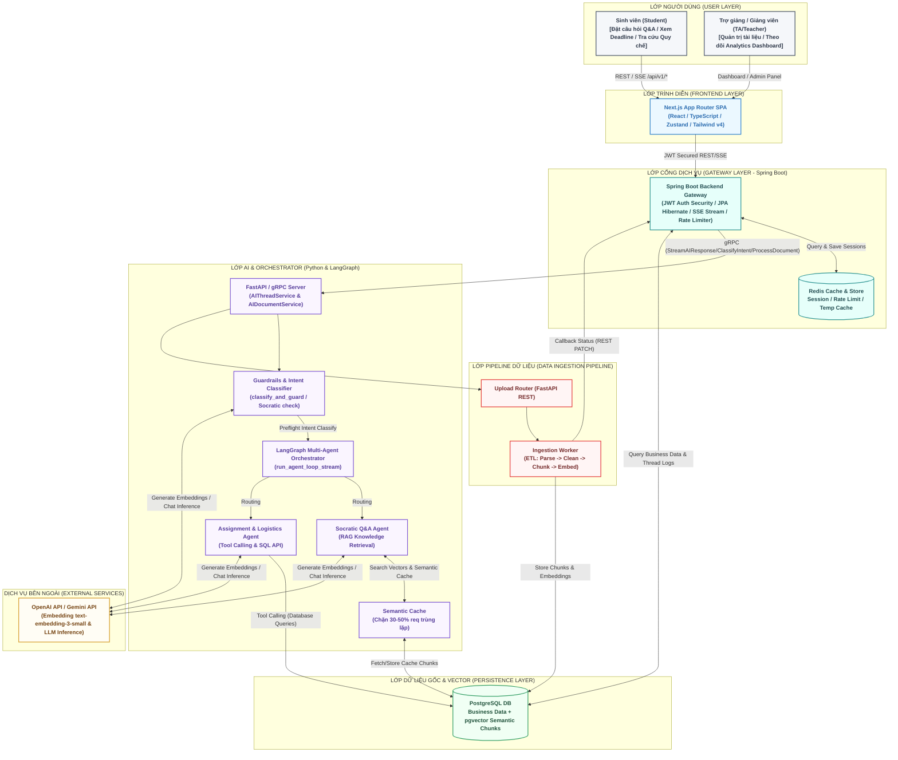
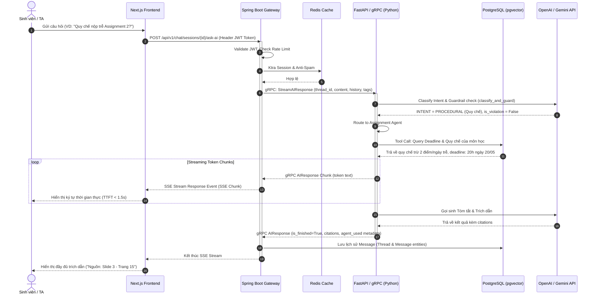
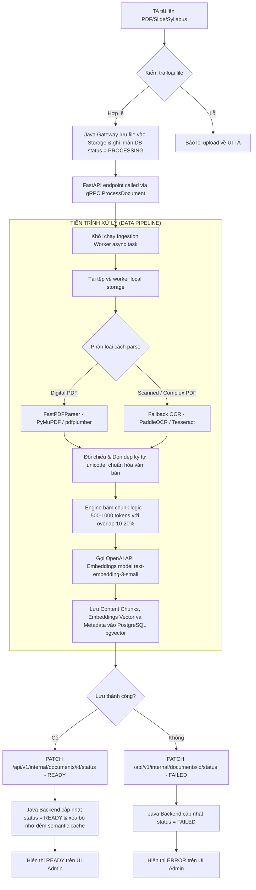
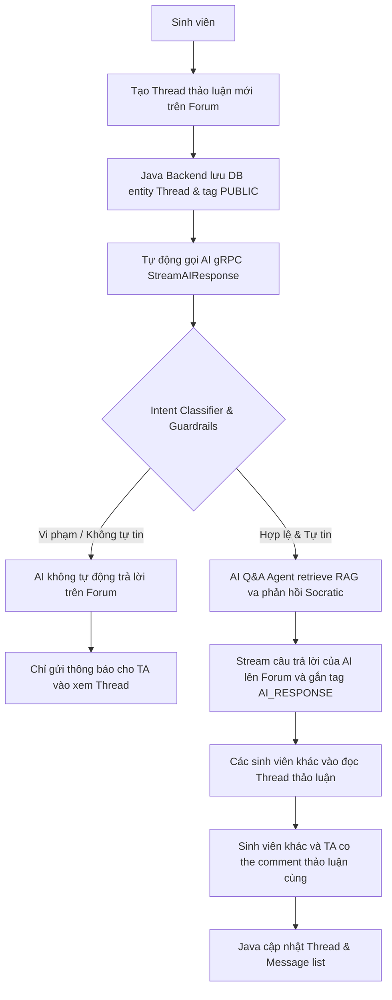
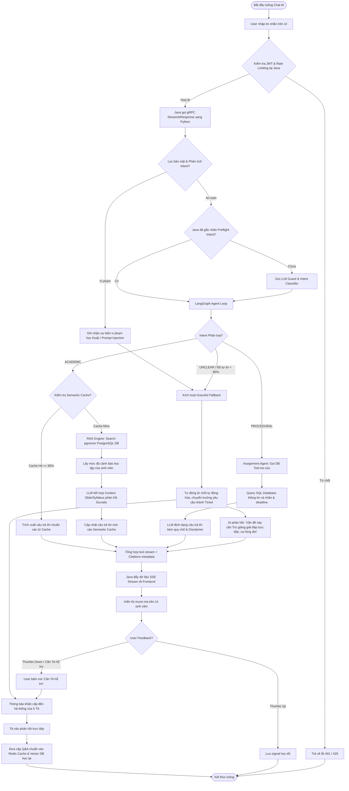
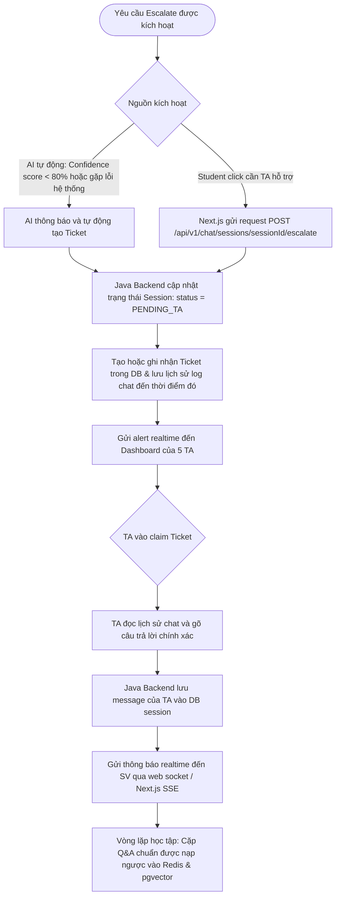
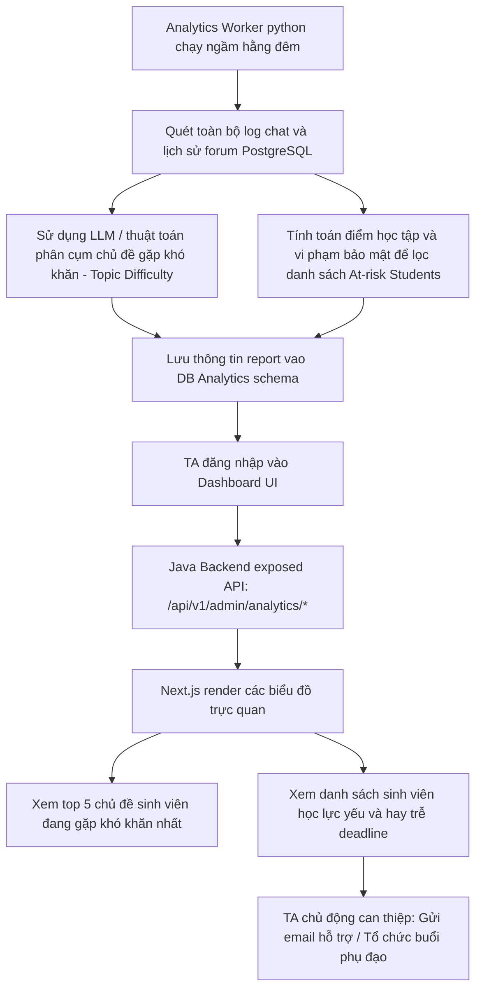
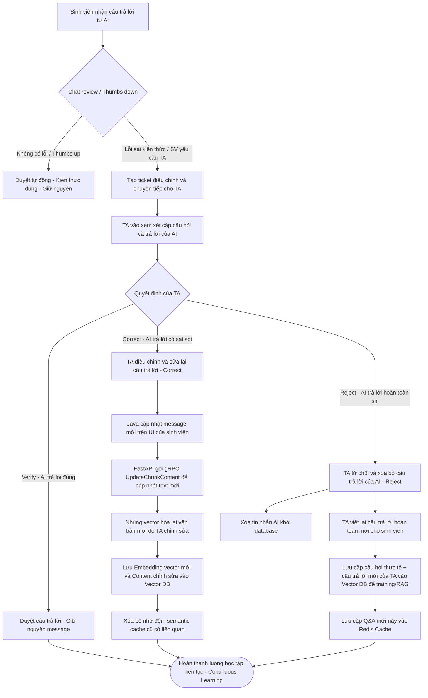
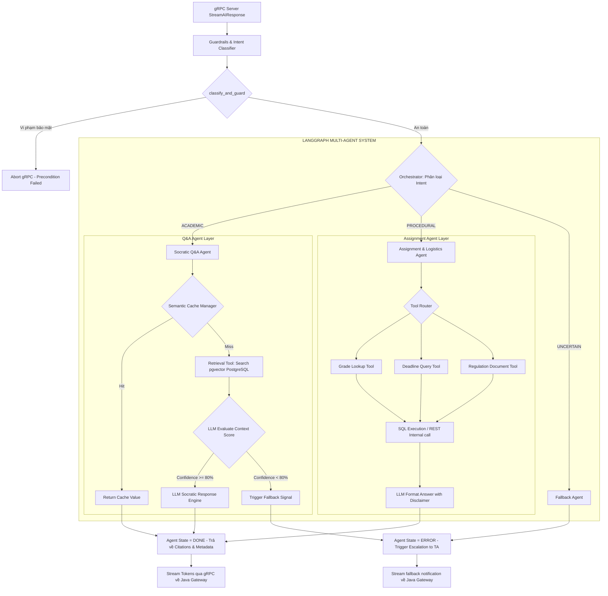

# EduPilot - Hệ Thống Trợ giảng Quy mô lớn- 9000+ Sinh viên
### Đề tài AIK024 - Nhóm AIK-128
### Thành viên thực hiện:
* **Lê Tuấn Đạt - 2A202600382** - Trưởng nhóm, phụ trách Frontend, Java Backend
* **Lê Văn Quang Trung - 2A202600383** - Phụ trách hoàn thiện UI, UX, Tinh chỉnh Agents
* **Mạc Phạm Thiên Long - 2A202600384** - Phụ trách AI Agents, Data Pipeline

---
## Video Demo: [Link Video Demo](https://drive.google.com/file/d/1YW6TyoQ9L1EVqjyKlHOXYj8u-GhqCDe8/view)
## Mô tả hệ thống

Hệ thống EduPilot là một nền tảng Multi-Agent hỗ trợ dạy và học quy mô lớn, được thiết kế chuyên biệt nhằm giải quyết bài toán tối ưu hóa nguồn lực trợ giảng (1 TA hỗ trợ cho 1800 sinh viên). Hệ thống tự động hóa lên tới 80% các câu hỏi học vụ và lý thuyết lặp đi lặp lại, rút ngắn thời gian phản hồi sinh viên từ 2-3 ngày xuống còn dưới 1.5 giây thông qua kiến trúc RAG nâng cao kết hợp bộ nhớ đệm ngữ nghĩa (Semantic Cache).

### Vấn đề cốt lõi và giải pháp

| Đối tượng | Thách thức hiện tại | Giải pháp từ EduPilot |
|-----------|-----------------|--------------|
| **Sinh viên** | Thời gian chờ phản hồi thắc mắc học vụ kéo dài từ 2-3 ngày, gây gián đoạn quá trình tiếp thu kiến thức. | Giải đáp tức thời (dưới 1.5 giây) bằng cơ chế RAG kết hợp gọi công cụ tự động (Tool Calling) chính xác. |
| **Trợ giảng (TA)** | Tình trạng quá tải và burnout do phải xử lý hàng ngàn câu hỏi lặp lại mỗi tuần từ quy mô hàng ngàn sinh viên. | Tự động hóa giải đáp các thắc mắc phổ biến; chuyển tiếp thông minh và tạo ticket hỗ trợ cho trợ giảng đối với các ca phức tạp. |

---

## Kiến trúc hệ thống

Dưới đây là sơ đồ kiến trúc tổng quan mô tả mối liên kết đa tầng giữa các thành phần giao diện, cổng dịch vụ Spring Boot, lõi xử lý AI Python LangGraph và hệ thống lưu trữ dữ liệu.



### Vai trò của từng thành phần dịch vụ

* **Lớp giao diện (Next.js)**: Cung cấp giao diện người dùng đơn trang (SPA) cho phép sinh viên tương tác qua các luồng Thảo luận (Thread), Hỏi đáp riêng tư (Chat) và hỗ trợ trợ giảng quản trị dữ liệu qua Dashboard phân tích.
* **Lớp cổng dịch vụ (Spring Boot)**: Đóng vai trò là bộ quản lý trạng thái hệ thống. Xác thực bảo mật qua JWT Token, quản lý phiên hội thoại, lưu trữ nhật ký và phân phối luồng stream phản hồi thời gian thực qua Server-Sent Events (SSE).
* **Lớp AI và điều phối (FastAPI + gRPC + LangGraph)**: Thực thi logic cốt lõi của tác tử AI. Phân loại mục đích (Intent Classifying), lọc nội dung độc hại (Guardrails), chạy vòng lặp tác tử (Agent Loop) và quản lý bộ đệm ngữ nghĩa.
* **Hệ cơ sở dữ liệu (PostgreSQL + pgvector)**: Lưu trữ các bảng dữ liệu nghiệp vụ chuẩn cùng các phân đoạn văn bản được nhúng dưới dạng vector 1536 chiều giúp tìm kiếm ngữ nghĩa nhanh chóng qua cấu trúc HNSW index.
* **Bộ nhớ đệm (Redis Stack)**: Lưu trữ thông tin phiên, kiểm soát tần suất gửi yêu cầu (Rate Limit) và làm bộ đệm tương tự vector (Semantic Cache) giúp loại bỏ tới 30-50% số lượng yêu cầu trùng lặp gửi đến mô hình ngôn ngữ lớn (LLM).

---

## Sơ đồ tương tác 3 lớp

Mô hình hóa tiến trình giao tiếp tuần tự đồng bộ và bất đồng bộ giữa ba lớp chính khi xử lý một yêu cầu hỏi đáp về học vụ của sinh viên.



---

## Tiến trình xử lý tài liệu học tập (Data Ingestion Pipeline)

Sơ đồ dưới đây mô tả chi tiết đường ống ETL bất đồng bộ xử lý tài liệu được trợ giảng tải lên hệ thống để phục vụ công nghệ RAG.



---

## Luồng hoạt động chính của sản phẩm

### 1. Luồng thảo luận diễn đàn (Thread Forum) - Công khai

Luồng xử lý hỗ trợ các câu hỏi mang tính chất cộng đồng học thuật chung. Mọi sinh viên tham gia khóa học đều có quyền đặt câu hỏi và tham khảo câu trả lời của AI cũng như đóng góp ý kiến thảo luận.



* **Cơ chế hoạt động**:
  * Các cuộc thảo luận được công khai trong lớp học ngoại trừ những luồng chuyển tiếp cần trợ giảng hỗ trợ.
  * AI giải đáp lý thuyết theo phương pháp sư phạm Socratic (gợi ý tìm tòi, không đưa ra lời giải trực tiếp ngay lập tức).
  * Trạng thái câu trả lời từ AI được phân loại rõ ràng: Mới khởi tạo (Unverified), Đã xác thực bởi TA (Verified), Đã được TA điều chỉnh (Corrected) và Bị TA từ chối ẩn đi (Rejected).

---

### 2. Luồng hội thoại bảo mật (Private Chat) - Riêng tư

Dành cho các thông tin nhạy cảm của từng sinh viên như tra cứu bảng điểm cá nhân, theo dõi hạn nộp bài tập và các quy chế học vụ liên quan trực tiếp đến sinh viên đó.



* **Cơ chế hoạt động**:
  * Các phiên chat được phân tách và mã hóa bảo mật nghiêm ngặt theo định danh phiên của sinh viên đăng nhập.
  * Tích hợp các chức năng gọi công cụ truy vấn thông tin nghiệp vụ thời gian thực từ cơ sở dữ liệu quan hệ.
  * Toàn bộ câu trả lời liên quan tới thời hạn bài tập đều bắt buộc đính kèm cảnh báo pháp lý (Disclaimer) để sinh viên đối chiếu lại với hệ thống LMS chính thức.

---

### 3. Luồng chuyển tiếp hỗ trợ (Escalation to TA)

Khi AI tự đánh giá độ tự tin dưới ngưỡng an toàn (dưới 80%), phát hiện lỗi hệ thống, hoặc khi sinh viên nhấn nút yêu cầu hỗ trợ trực tiếp, toàn bộ ngữ cảnh hội thoại sẽ được đóng gói và chuyển tiếp về hàng đợi khẩn cấp của trợ giảng.



* **Cơ chế hoạt động**:
  * Các phiên hội thoại cần trợ giảng can thiệp sẽ thay đổi trạng thái sang PENDING_TA trong cơ sở dữ liệu.
  * Hệ thống phát tín hiệu cảnh báo trực tiếp (real-time alert) đến bảng quản trị của toàn bộ đội ngũ trợ giảng.
  * Phản hồi thực tế từ trợ giảng sau đó sẽ tự động được thu thập và nạp ngược lại vào bộ đệm và Vector DB nhằm hoàn thiện tri thức hệ thống.

---

### 4. Bảng quản trị và phân tích của trợ giảng (TA Dashboard Analytics)

Công cụ đắc lực hỗ trợ trợ giảng giám sát chất lượng giảng dạy, thống kê các chủ đề sinh viên gặp khó khăn và hỗ trợ các trường hợp sinh viên có nguy cơ rớt môn (At-Risk).



#### Vòng lặp phản hồi và hiệu chỉnh tri thức AI (Verify/Correct/Reject)

Mô tả chi tiết quy trình trợ giảng đánh giá và hiệu chỉnh các câu trả lời do AI tạo ra để huấn luyện liên tục hệ thống tri thức.



---

## Kiến trúc tác tử thông minh (Multi-Agent System)

### Cơ chế LangGraph Multi-Agent Orchestrator

Dưới đây là thiết kế luồng quyết định bên trong Agent Loop, mô tả sự phân phối yêu cầu giữa các Agent chuyên môn và cơ chế kiểm soát chất lượng phản hồi.



### Các lớp bảo vệ (Guardrails) và tiêu chuẩn an toàn

* **Phát hiện tấn công Prompt Injection**: Tự động phát hiện các chuỗi mã độc nhập vào ô chat nhằm mục đích bẻ khóa hệ thống AI (bỏ qua hướng dẫn gốc, mạo nhận quyền quản trị viên).
* **Lọc thông tin cá nhân (PII Protection)**: Chặn việc sinh viên vô tình đăng các thông tin định danh nhạy cảm (Mã số sinh viên, số điện thoại, thư điện tử cá nhân) lên bảng tin thảo luận công khai.
* **Cơ chế đánh giá độ tin cậy**: AI tự đo lường độ chính xác của phản hồi dựa trên ngữ cảnh được trích xuất. Nếu độ tự tin dưới 80%, hệ thống tự động ngắt câu trả lời tự động và kích hoạt luồng khẩn cấp chuyển trợ giảng.
* **Nguyên tắc Socratic**: AI chỉ gợi mở và cung cấp tài liệu tự nghiên cứu, tuyệt đối không giải hộ bài tập hoặc viết hộ mã nguồn cho sinh viên.
* **Kiểm soát tần suất (Rate Limiting)**: Giới hạn lưu lượng yêu cầu của từng sinh viên trong mỗi phút tại lớp Spring Boot Gateway nhằm ngăn chặn các hành vi tấn công từ chối dịch vụ (DoS/DDoS).

---

## Công nghệ sử dụng

### Lớp giao diện (Frontend)
* **Next.js 14+**: Khung phát triển ứng dụng web hiện đại, hỗ trợ cơ chế render phía máy chủ (SSR), tối ưu hóa định tuyến.
* **TypeScript 5.x**: Đảm bảo an toàn kiểu dữ liệu trong toàn bộ mã nguồn frontend.
* **TailwindCSS**: Thư viện thiết kế giao diện linh hoạt, tối ưu hóa CSS lớp phủ.

### Lớp dịch vụ trung gian (Java Backend)
* **Spring Boot 3**: Xây dựng hệ thống RESTful API cốt lõi, quản lý kết nối gRPC và truyền tải SSE non-blocking.
* **Spring Security & Spring Session**: Quản lý phiên làm việc của người dùng, xác thực bảo mật và phân quyền vai trò người dùng (Sinh viên, Trợ giảng, Quản trị viên).
* **Spring Data JPA & Hibernate**: Tương tác trực quan và quản lý quan hệ dữ liệu trong cơ sở dữ liệu PostgreSQL.
* **gRPC Client**: Thực hiện kết nối mạng tốc độ cao đến máy chủ Python AI.

### Lớp trí tuệ nhân tạo (Python AI Service)
* **FastAPI**: Cung cấp các endpoint cấu hình REST và giám sát trạng thái sức khỏe dịch vụ.
* **gRPC Server**: Xử lý các luồng yêu cầu StreamAIResponse tốc độ cao từ Spring Boot.
* **OpenAI API & LangGraph-style Loop**: Điều phối đa tác tử AI, thực hiện kỹ thuật sinh văn bản có kiểm soát kèm theo gọi công cụ nghiệp vụ.
* **pgvector (PostgreSQL Extension)**: Thực hiện tính toán khoảng cách vector ngữ nghĩa lưu trữ trên cơ sở dữ liệu.
* **Redis Stack**: Hỗ trợ cơ chế Semantic Cache sử dụng tìm kiếm lân cận KNN trên không gian vector.

### Cơ sở hạ tầng và điều phối (Infrastructure)
* **Docker & Docker Compose**: Đóng gói và điều phối đồng bộ 5 thành phần dịch vụ chính trên các môi trường độc lập.
* **PostgreSQL**: Lưu trữ hệ dữ liệu quan hệ kết hợp tính năng mở rộng pgvector.
* **Redis Stack**: Đảm nhận vai trò bộ nhớ đệm tốc độ cao và semantic cache.
* **Jaeger Tracing**: Giám sát phân tán độ trễ và vết thực thi của toàn bộ hệ thống từ khi yêu cầu xuất hiện tại Next.js cho đến khi LLM phản hồi.

---

## Cấu trúc thư mục dự án

```
A20-App-128/
├── backend-java/              # Spring Boot 3 Gateway & Core Logic
│   └── aitrogiang/
│       ├── src/main/java/team/_8/aitrogiang/
│       │   ├── config/        # Cấu hình gRPC Client, CORS, OpenApi/Swagger
│       │   ├── constant/      # Các hằng số nghiệp vụ & mã trạng thái hệ thống
│       │   ├── controller/    # RESTful API Endpoints & Server-Sent Events (SSE)
│       │   ├── dto/           # Data Transfer Objects trao đổi dữ liệu giữa các phân hệ
│       │   ├── exception/     # Quản lý lỗi tập trung & các Custom Exception
│       │   ├── model/         # Các thực thể JPA (User, Session, Message, Thread, Post, Document, Analytics, etc.)
│       │   ├── repository/    # Các interface Spring Data JPA tương tác với PostgreSQL
│       │   ├── security/      # JWT Security, Privacy Firewall Filter (lọc dữ liệu PII nhạy cảm)
│       │   ├── service/       # Logic nghiệp vụ chi tiết (Forum, PrivateChat, ChatStreaming, Admin, Analytics)
│       │   └── util/          # Các hàm helper và tiện ích hỗ trợ
│       └── src/test/java/team/_8/aitrogiang/ # Bộ kiểm thử tích hợp & Unit Test của Java Backend
│
├── frontend/                  # Next.js 14+ Frontend (App Router, SPA)
│   ├── public/                # Tài nguyên tĩnh (Hình ảnh, Icons)
│   └── src/
│       ├── app/               # Next.js App Router (Định tuyến trang)
│       │   ├── analytics/     # Dashboard theo dõi chỉ số học vụ dành cho TA
│       │   ├── assignments/   # Giao diện tra cứu và quản lý bài tập của sinh viên
│       │   ├── at-risk/       # Báo cáo danh sách sinh viên học lực yếu cần hỗ trợ
│       │   ├── chat/          # Giao diện Chat bảo mật riêng tư với AI
│       │   ├── documents/     # Khu vực quản trị và upload tài liệu học liệu của TA
│       │   ├── login/         # Module đăng nhập tài khoản
│       │   ├── register/      # Module đăng ký tài khoản sinh viên
│       │   ├── test-theme/    # Khu vực kiểm thử hệ thống giao diện
│       │   ├── threads/       # Diễn đàn thảo luận, trao đổi công khai (Q&A Forum)
│       │   ├── globals.css    # Cấu hình CSS toàn cục & biến màu sắc
│       │   ├── layout.tsx     # Giao diện khung chuẩn (Main Layout)
│       │   └── page.tsx       # Trang chủ giới thiệu sản phẩm (Landing Page)
│       ├── components/        # Các thành phần UI tái sử dụng (Buttons, Cards, Chat Window, etc.)
│       ├── config/            # Cấu hình môi trường và cài đặt Client
│       ├── features/          # Các tính năng giao diện nghiệp vụ cụ thể
│       ├── hooks/             # Custom React Hooks tiện ích
│       ├── lib/               # Thư viện tiện ích ngoài (Zustand store, Axios client)
│       ├── middleware.ts      # Middleware Next.js kiểm soát đăng nhập & phân quyền truy cập
│       ├── services/          # Các kết nối API giao tiếp với Spring Boot Gateway
│       ├── store/             # Quản lý trạng thái toàn cục bằng Zustand (AuthStore, ChatStore)
│       └── types/             # Định nghĩa Type/Interface TypeScript
│
├── src/                       # Python AI Service (FastAPI + gRPC + LangGraph)
│   ├── api/                   # RESTful Endpoint hỗ trợ từ FastAPI
│   ├── database/              # Tương tác các kho lưu trữ
│   │   ├── analytics_repo.py  # Thuật toán phân tích và tính toán rủi ro của sinh viên
│   │   ├── cache_repo.py      # Semantic Cache sử dụng Redis Stack
│   │   ├── connection.py      # Quản lý kết nối PostgreSQL & Redis Connection Pool
│   │   ├── models.py          # Lược đồ mô hình SQLAlchemy
│   │   ├── schema.py          # Lược đồ Pydantic kiểm tra kiểu dữ liệu đầu vào
│   │   └── vector_repo.py     # Tìm kiếm ngữ nghĩa pgvector PostgreSQL
│   ├── workers/               # Các tiến trình ngầm
│   │   └── analytics_worker.py # Background worker tính toán chỉ số hàng ngày, dọn dẹp bộ nhớ
│   ├── tests/                 # Bộ unit tests & regression tests cho AI
│   │   ├── privacy_regression_suite.py # Regression test bảo vệ dữ liệu PII (22 testcases)
│   │   ├── test_agent_routing.py   # Test định tuyến Agent LangGraph
│   │   ├── test_guardrails.py      # Test bộ lọc an toàn và Prompt Injection
│   │   ├── test_preflight_hint.py  # Test tối ưu hóa định tuyến trước của Gateway
│   │   ├── test_rag_citations.py   # Test kiểm soát độ trích dẫn chính xác (RAG)
│   │   └── test_tools_assignment.py # Test gọi công cụ của Assignment Agent
│   ├── agent.py               # Lõi điều phối LangGraph Multi-Agent Orchestrator
│   ├── config.py              # Biến cấu hình môi trường Python
│   ├── document_callback.py   # Callback cập nhật trạng thái xử lý tài liệu sang Java
│   ├── grpc_server.py         # Thực thi gRPC Server (StreamAIResponse, ProcessDocument)
│   ├── guardrails.py          # Lớp bảo vệ (lọc mã độc, Prompt Injection, scrub PII, Socratic)
│   ├── logging_config.py      # Logging có cấu trúc chuẩn JSONL (BTC-compliant)
│   ├── main.py                # Điểm khởi chạy FastAPI chính (REST & Health)
│   ├── observability.py       # Distributed Tracing sử dụng Jaeger Client
│   └── tools.py               # Các công cụ RAG & SQL Tool cho AI Agents
│
├── data_pipeline/             # Pipeline xử lý dữ liệu ETL bất đồng bộ
│   ├── api/                   # FastAPI Endpoints tiếp nhận file upload
│   ├── pipeline/              # Lõi quy trình ETL
│   │   ├── chunking.py        # Phân mảnh văn bản thông minh (Overlap chunking)
│   │   ├── cleaner.py         # Làm sạch ký tự unicode và chuẩn hóa văn bản
│   │   ├── document_parser.py # Bộ parse PDF/DOCX (PyMuPDF & Fallback PaddleOCR)
│   │   └── embedding.py       # Tạo vector đặc trưng qua OpenAI Embedding Model
│   ├── workers/               # Ingest workers chạy bất đồng bộ
│   ├── e2e_final_check.py     # Script kiểm tra tích hợp đầu-cuối
│   ├── generate_mock_data.py  # Tạo dữ liệu giả lập cho mục đích kiểm thử
│   ├── stress_test_pipeline.py # Script đo tải và hiệu năng xử lý văn bản
│   └── verify_quality.py      # Kiểm nghiệm chất lượng sau khi trích xuất
│
├── db/                        # Cơ sở dữ liệu
│   └── migration/             # Lược đồ di trú cơ sở dữ liệu PostgreSQL (V1 -> V22)
│
├── shared-proto/              # Định nghĩa giao thức gRPC
│   └── ai_service.proto       # File mô tả interface gRPC và Protobuf
│
├── scripts/                   # Các kịch bản tự động hóa & công cụ tiện ích
│   ├── init_pgvector.sql      # Tạo cấu trúc DB PostgreSQL và kích hoạt pgvector
│   ├── run_migrations.py      # Thực thi các file SQL migrations tự động
│   └── log_hook.py            # Hook tự động ghi nhật ký hệ thống
│
├── data/                      # Kho lưu trữ tài liệu học tập mẫu (Syllabus, Slide)
├── benchmarks/                # Bộ dữ liệu và script đánh giá chất lượng RAG (RAGAS framework)
├── reports/                   # Các báo cáo tiến độ kỹ thuật chi tiết (TIP-001 -> TIP-005)
├── Dockerfile                 # Dockerfile đóng gói Python AI service
├── docker-compose.local.yml   # Cấu hình khởi dựng Docker cho local development
├── docker-compose.prod.yml    # Cấu hình tối ưu chạy Docker cho production
├── requirements.txt           # Thư viện phụ thuộc của Python
└── spec.md                    # Tài liệu đặc tả kỹ thuật chi tiết của hệ thống
```

---

## Hướng dẫn cài đặt và khởi chạy hệ thống cục bộ

Tiến trình cài đặt và chạy thử nghiệm hệ thống được thực hiện trên môi trường máy chủ cục bộ thông qua tệp tin cấu hình container hóa `docker-compose.local.yml`.

### Yêu cầu hệ thống trước khi cài đặt
* Máy tính đã cài đặt **Docker** và **Docker Compose** phiên bản mới nhất.
* Tài khoản có quyền truy cập dịch vụ và có sẵn khóa API từ **OpenAI** (OpenAI API Key)/Claude.

### Bước 1: Sao chép mã nguồn và cấu hình biến môi trường
Tải toàn bộ mã nguồn dự án về máy tính cá nhân và tiến hành thiết lập các biến cấu hình cần thiết:

```bash
# 1. Truy cập thư mục chứa mã nguồn dự án
cd A20-App-128

# 2. Tạo tệp tin biến môi trường cục bộ từ bản mẫu
cp .env.example .env.local
```

Mở tệp tin `.env.local` vừa tạo bằng trình soạn thảo văn bản và cập nhật khóa OpenAI API của bạn cùng các cấu hình kết nối mong muốn:
```env
OPENAI_API_KEY=your_openai_api_key_here
DB_USERNAME=user
DB_PASSWORD=password
```

### Bước 2: Khởi dựng hệ thống bằng Docker Compose
Khởi động đồng thời cả 5 thành phần dịch vụ của hệ thống thông qua tệp cấu hình môi trường cục bộ:

```bash
docker compose -f docker-compose.local.yml up -d --build
```

Lệnh này sẽ tiến hành tải hình ảnh container cần thiết, xây dựng mã nguồn Java, đóng gói Python AI, thiết lập mạng nội bộ cục bộ và chạy ngầm toàn bộ hệ thống.

### Bước 3: Kiểm tra trạng thái hoạt động của các dịch vụ
Sau khi quá trình khởi động hoàn tất, bạn có thể kiểm tra danh sách container đang chạy và truy cập vào các cổng dịch vụ công khai tương ứng:

```bash
docker compose -f docker-compose.local.yml ps
```

* **Frontend Next.js**: Truy cập qua trình duyệt tại địa chỉ `http://localhost:3000`
* **Java Gateway Service**: REST API công khai tại `http://localhost:8080`
* **Python AI Engine**: REST API phụ tại `http://localhost:8000`
* **Jaeger Tracing Dashboard**: Quản lý độ trễ dịch vụ tại `http://localhost:16686`
* **Cơ sở dữ liệu PostgreSQL**: Cổng kết nối dữ liệu tại `localhost:5432`
* **Redis Stack Server**: Bộ nhớ đệm và giao diện RedisInsight tại `localhost:6379`

---

## Hướng dẫn sử dụng sản phẩm

Hệ thống cung cấp trải nghiệm phân quyền rõ ràng giữa hai đối tượng người dùng chính:

### Dành cho Sinh viên (Student)
1. **Tra cứu diễn đàn thảo luận công khai (Forum Threads)**: 
   * Sinh viên đăng nhập vào hệ thống, truy cập khu vực **Forum**.
   * Nhấn **Tạo Thread mới** để đặt câu hỏi lý thuyết hoặc bài tập. AI sẽ tự động phân tích và đưa ra phản hồi theo phương pháp Socratic để định hướng tư duy học tập.
   * Sinh viên co thể bình luận, trao đổi trực tiếp trên các thread thảo luận của các bạn học khác cùng lớp.
2. **Trò chuyện riêng tư bảo mật (Private Chat)**:
   * Vào mục **Chat** để mở phiên trò chuyện cá nhân bảo mật với AI.
   * Hỏi các câu hỏi cá nhân về hạn nộp bài tập, điểm thi hoặc quy chế môn học riêng tư. AI sẽ gọi các công cụ kết nối DB để đưa ra câu trả lời chính xác nhất.
3. **Yêu cầu hỗ trợ từ Trợ giảng (Escalation)**:
   * Nếu câu trả lời từ AI chưa đáp ứng mong muốn hoặc độ tin cậy thấp, sinh viên nhấn nút **Cần TA hỗ trợ**.
   * Hệ thống sẽ tự động ghim thread đó lên hàng đợi kiểm duyệt và thông báo đến trợ giảng của lớp học để xử lý trực tiếp.

### Dành cho Trợ giảng và Giảng viên (TA/Teacher)
1. **Theo dõi bảng điều khiển phân tích (Analytics Dashboard)**:
   * TA đăng nhập tài liệu quản trị và truy cập **Dashboard**.
   * Theo dõi lượng câu hỏi theo thời gian, tỷ lệ AI tự giải quyết thành công và danh sách sinh viên học lực yếu có nguy cơ rớt môn (At-Risk Students).
   * Xem mục **Topic Difficulty** để nắm được top 5 chủ đề môn học sinh viên đang gặp nhiều vướng mắc nhất để bổ sung bài giảng phụ đạo.
2. **Kiểm duyệt và chỉnh sửa tri thức AI (Verify/Correct/Reject)**:
   * TA duyệt qua lịch sử câu hỏi trên Forum công khai.
   * Nhấn **Verify** nếu câu trả lời của AI chính xác để đóng chủ đề và gán nhãn Verified cho sinh viên tin tưởng.
   * Nhấn **Correct** để chỉnh sửa trực tiếp nội dung phản hồi của AI nếu có sai sót nhỏ. Tri thức hiệu chỉnh sẽ được cập nhật tự động vào hệ thống vector tri thức.
   * Nhấn **Reject** đối với câu trả lời sai hoàn toàn. Hệ thống sẽ ẩn phản hồi đó khỏi sinh viên và cho phép TA viết lại phản hồi chính xác để huấn luyện lại AI.
3. **Quản trị tài nguyên môn học (Document Management)**:
   * Vào khu vực **Documents** để tải lên slide bài giảng mới hoặc giáo trình cập nhật (PDF/Slide).
   * Hệ thống sẽ tự động kích hoạt đường ống Data Ingestion ngầm để phân mảnh, vector hóa và cập nhật dữ liệu tri thức mới cho AI sẵn sàng trả lời ở các phiên tiếp theo.

---

## Các chỉ số đánh giá và nghiệm thu

Hệ thống áp dụng các tiêu chí đo lường chất lượng phản hồi chuẩn quốc tế (RAGAS framework) nhằm kiểm soát rủi ro về chất lượng thông tin:

| Chỉ số kiểm định | Ngưỡng nghiệm thu tiêu chuẩn | Ngưỡng cảnh báo đỏ (Red Flag) |
|--------|-------------------|----------|
| **Context Precision** (Độ chính xác ngữ cảnh trích xuất) | ≥ 90% | < 80% |
| **Hallucination Rate** (Tỷ lệ thông tin sai lệch/ảo giác) | < 5% | > 10% |
| **Automation Rate** (Tỷ lệ tự động hóa giải đáp thành công) | ≥ 80% | < 50% |
| **Cache Hit Ratio** (Tỷ lệ phản hồi trích xuất từ Semantic Cache) | ≥ 30% | < 15% |

---

## Thông tin bản quyền

MIT
