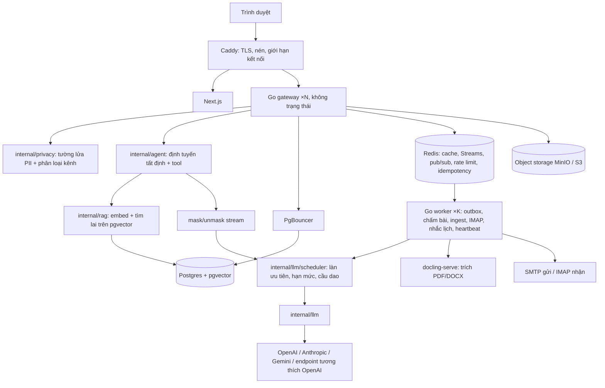

# EduPilot v2 — Kiến trúc và hợp đồng kỹ thuật

Tài liệu tra cứu cho Claude Code. Yêu cầu nghiệp vụ ở `PRD.md`; việc cần làm ở `phases/`; lý do thiết kế, ước lượng tải và SLO ở `SYSTEM_DESIGN.md`; chuẩn giao diện ở `UX.md`.

## 1. Tổng quan



Không có tiến trình Python nào trong sơ đồ: D46 chốt gateway và worker Go tự gọi LLM, tự truy vấn pgvector, tự che danh tính. `docling-serve` là container dùng sẵn, chỉ nói chuyện HTTP.

| Thành phần | Nằm ở | Trách nhiệm |
| --- | --- | --- |
| Go Gateway | `backend-go/cmd/gateway` | REST, SSE, auth, RBAC, nghiệp vụ và AI trong cùng tiến trình |
| Go Worker | `backend-go/cmd/worker` | Consumer Redis Streams: `grading.jobs`, `mail.inbound`, `mail.outbox`, `reminder.jobs`, `reindex.jobs`, `heartbeat.rollup`; cron; retry 3 lần → dead-letter |
| LLM Gateway + Scheduler | `internal/llm`, `internal/llm/scheduler` | `Chat`, `Stream`, `Structured(json_schema)`, `Embed` trên `openai-go`; registry provider theo base URL tương thích OpenAI; chọn model theo task từ DB; fallback; ghi `llm_audit`; bọc `mask`/`unmask`. Scheduler: ba làn ưu tiên, token bucket RPM/TPM trên Redis, semaphore, cầu dao, deadline từ `context.Context`, hàng chờ có giới hạn (back pressure), suy giảm sang trả lời trích xuất |
| RAG | `internal/rag` | Chunk, embed, tìm lai vector + từ khoá bằng SQL trên pgvector; truy xuất tất định, không LLM trên đường nóng (D47) |
| Agent | `internal/agent` | Định tuyến tất định theo ý định đã phân loại → tool Go → đúng một lần sinh chữ; tool dữ liệu cá nhân nhận danh tính từ trusted context. Không vòng lặp agent mở |
| Blob | `internal/platform/blob` | Giao diện `Put/Get/PresignPut/PresignGet/Delete`; MinIO (dev, tự host) hoặc S3; DB chỉ lưu khoá object |
| Outbox | `internal/platform/outbox` | Ghi nghiệp vụ + dòng `outbox` trong cùng transaction; worker phát thông báo, mail, sự kiện vô hiệu cache; at-least-once + khử trùng |
| PII | `internal/privacy` | Regex + từ điển roster ở middleware kênh công khai; phân loại kênh bằng luật + độ tương đồng embedding; `redact`, `mask`, `unmask`, `unmask_stream` |
| Grading Engine | `internal/grading` | Bỏ tên/MSSV, chấm theo rubric bằng structured output (`json_schema`), hai lượt |
| Ingest | `internal/ingest` (worker) | Gọi `docling-serve` qua HTTP để trích văn bản PDF/DOCX, rồi chunk + embed qua `internal/rag` |
| Quiz Engine | `internal/quiz` | Chấm trắc nghiệm/đúng–sai/trả lời ngắn bằng code; dùng cho QUIZ, import Forms, luyện đề |
| Grade Engine | `internal/grade` | Tính điểm decimal từ `grade_components` + `grade_rules`; snapshot; XLSX |
| Mail | `internal/mail` | go-mail + `html/template` gửi qua `mail_outbox`; go-imap poll 60 s chỉ để nhận bài nộp |
| Notify | `internal/notify` | Bảng `notifications` + SSE `/notifications/stream` |
| Submission Sources | `internal/submission/source` | `SubmissionSource`: `ImapSource`, `UploadSource`, `FormsImportSource`, `InAppSource` (mặc định), `TeamsGraphSource` (cờ; địa chỉ Graph cấu hình được) |
| mock-graph | `backend-go/cmd/mock-graph` (chỉ có ở compose local) | Giả lập token endpoint + Education API của Microsoft Graph theo đúng ví dụ tài liệu; 7 kịch bản lỗi bật được; nhật ký request cho test. Adapter không biết mình đang nói chuyện với bản giả |

## 2. Cấu trúc `backend-go`

```text
backend-go/
  cmd/gateway/main.go
  cmd/worker/main.go
  cmd/mock-graph/main.go   # chỉ dùng cho dev/test
  internal/
    platform/     # config env, slog, otel, redis, crypto AES-GCM, clock, blob, outbox
    auth/         # JWT, bcrypt, RBAC, CourseAccessGuard
    httpapi/      # router chi, middleware, mã lỗi, DTO chung, validation
    sse/
    llm/          # gateway provider (openai-go): chat, stream, structured, embed, fallback, llm_audit
    llm/scheduler/# ba làn ưu tiên, token bucket Redis, cầu dao, deadline, hàng chờ có giới hạn
    rag/          # chunk, embed, tìm lai vector + từ khoá trên pgvector
    privacy/      # detect, redact, mask, unmask_stream, phân loại kênh (luật + embedding)
    grading/      # chấm theo rubric bằng structured output, hai lượt
    agent/        # định tuyến tất định + tool dữ liệu cá nhân (danh tính từ trusted context)
    ingest/       # worker: gọi docling-serve, chunk, embed
    store/        # sqlc: queries/*.sql → generated
    jobs/
    contract/     # contract test: response khớp api/openapi.yaml
    chat/ thread/ document/ analytics/ assignment/ user/
    course/ crm/ grade/ quiz/ submission/ escalation/ notify/ mail/
    calendar/ library/ insight/ llmconfig/ activity/ observability/ today/
  db/migrations/  # goose, từ 00001 (D45: không kế thừa schema Project III)
  api/openapi.yaml
  sqlc.yaml  Dockerfile  Makefile
```

Mỗi module: `handler.go` (mỏng) · `service.go` (logic, transaction, audit) · `repo.go` (gọi sqlc) · `*_test.go`.

## 3. Thư viện được phép

| Việc | Go |
| --- | --- |
| Router | `go-chi/chi` v5 |
| DB | `jackc/pgx` v5 + `sqlc` + `pgvector-go` |
| Migration | `pressly/goose` |
| Auth | `golang-jwt/jwt` v5 + `x/crypto/bcrypt` |
| Validation | `go-playground/validator` |
| Redis | `redis/go-redis` v9 |
| LLM / embedding | `openai/openai-go` (một client cho mọi provider có endpoint tương thích OpenAI) |
| SSE | `net/http` + `http.Flusher` |
| Mail gửi / nhận | `wneessen/go-mail` + `html/template` / `emersion/go-imap` v2 + `go-message` |
| XLSX | `xuri/excelize` v2 |
| Thập phân | `shopspring/decimal` |
| Cron | `robfig/cron` v3 |
| OpenAPI | `oapi-codegen` |
| Quan sát | OpenTelemetry Go + `log/slog` |
| Object storage | `minio/minio-go` v7 (tương thích S3) |
| Test | `testing` + `testify` + `testcontainers-go` + REST API Mailpit |

Frontend giữ: Next.js, React, zustand (chỉ trạng thái UI + phiên), tailwind, recharts; thêm `@tanstack/react-query`, `@tanstack/react-virtual`, `lucide-react` (thư viện icon DUY NHẤT), font Be Vietnam Pro qua `next/font`, Playwright, `@axe-core/playwright`, Lighthouse CI.
Hạ tầng thêm trong compose: Caddy, PgBouncer, MinIO, Mailpit, `docling-serve` (trích PDF/DOCX cho worker), mock-graph (chỉ local). Test tải: k6.
Python chỉ xuất hiện ở `benchmarks/` cho script đánh giá offline (D46); không có thư viện Python nào nằm trong đường chạy của sản phẩm.

## 4. Lược đồ dữ liệu

Mọi bảng: UUID, `created_at`, `updated_at`; bảng nghiệp vụ có `course_id`. Không sửa migration đã merge. Vì viết mới (D45) nên **không ALTER cho cột đã biết trước**: mọi cột liệt kê ở đây nằm ngay trong câu `CREATE TABLE` của phase sở hữu.

| Migration | Phase | Nội dung |
| --- | --- | --- |
| 00001 pg_platform | PG | `users(email UNIQUE, password_hash, full_name, role ADMIN/TEACHER/TA/STUDENT, student_code, email_verified_at, failed_logins, locked_until, status, ics_token, tracking_notice_ack_at)`; `audit_log(actor_id, entity, entity_id, action, before jsonb, after jsonb)`; `outbox(id, topic, payload jsonb, created_at, dispatched_at)`; `jobs(id, kind, status, progress, result jsonb, owner_id)`; `idempotency_keys(key, user_id, endpoint, response jsonb)`; extension `vector` |
| 00002 llm | P1 | `llm_providers(type, name, base_url, api_key_enc, enabled)`; `llm_models(provider_id, model, kind, dims, price_in, price_out)`; `llm_task_routes(task, model_id, fallback_order, params jsonb)`; `llm_audit(task, provider, model, tokens_in, tokens_out, latency_ms, pii_masked_count, status, user_id, course_id, trace_id)`; `llm_budgets(scope, course_id, daily_limit, monthly_limit)` |
| 00003 course_foundation | P2 | `courses(subject_code, class_code UNIQUE, name, semester, status ACTIVE/ARCHIVED, escalation_threshold, settings jsonb, join_code CHAR(7) UNIQUE, join_enabled, join_expires_at, join_require_approval, allowed_email_domain, capacity, created_by, archived_at)`; `enrollments(course_id, user_id, role_in_course TEACHER/TA/STUDENT, status PENDING/ACTIVE/REMOVED, joined_via ADMIN/ROSTER/CODE, student_code_snapshot)` UNIQUE(course, user); `class_sessions(course_id, session_no, starts_at, ends_at, room, topic)`; `notifications(user_id, course_id, type, title, body, link, read_at)` (đẩy SSE + mail đến ở P4); `user_settings(user_id, notify_ticket_by_mail, …)`; `documents(course_id, title, type LECTURE/COURSE_POLICY/EXAM_PAPER/ANSWER_KEY/OTHER, blob_key, status, visible_to_students, use_for_rag, category, week_no, download_count)` CHECK `ANSWER_KEY` ⇒ `visible_to_students=false`; `content_chunks(document_id, course_ids uuid[] GIN, audience, ord, text, embedding vector(1536))`; `document_courses(document_id, course_id)` |
| 00004 auth_hardening | P2 | `auth_sessions(user_id, refresh_hash, user_agent, ip, expires_at, revoked_at)`; `auth_tokens(user_id, kind VERIFY_EMAIL/RESET_PASSWORD/INVITE, token_hash, expires_at, used_at)`; `login_attempts`; `mail_outbox(to_addr, template, payload jsonb, status, attempts, last_error)` (lõi gửi mail về P2 theo D36) |
| 00005 chat_threads | P3 | `chat_sessions(course_id, user_id, channel PRIVATE/PUBLIC, title, last_message_at)`; `chat_messages(session_id, role, content, partial_content, stream_status STREAMING/DONE/FAILED/CANCELLED, citations jsonb, confidence)`; `forum_threads(course_id, author_id, title, tags text[], state, similar_of)`; `forum_posts(thread_id, author_id, body, kind AI/HUMAN, verification_state, hidden_at, hidden_reason)` |
| 00006 privacy | P3 | `pii_events(course_id, session_id, user_id, channel, pii_type, count, action BLOCKED/REDACTED/SWITCHED/MASKED)` |
| 00007 escalation_notify | P4 | `escalation_tickets(course_id, source_type, source_id, message_id UNIQUE, student_id, status, kind QUESTION/GRADE_APPEAL/TEACHER_OUTREACH, appeal_payload jsonb, confidence, claimed_by, answer, answered_at, save_as_knowledge)`; `mail_inbound(message_uid UNIQUE, from_addr, subject, received_at, status)`; `post_reports(post_id, reporter_id, reason)` (`mail_outbox` đã tạo ở 00004) |
| 00008 crm | P5 | `attendance_records(session_id, student_id, status, note, marked_by, version int)` UNIQUE(session, student); `participation_events(course_id, student_id, session_id, type, points numeric(4,2), note, created_by)`; `student_observations(course_id, student_id, author_id, tags text[], body)`; view `v_student_360`, `v_attendance_summary` |
| 00009 observation | P5 | `study_time_daily(course_id, student_id, date, area, active_seconds)` UNIQUE(student, date, area); `insight_reports(course_id, kind, period_from, period_to, payload jsonb, data_watermark, generated_by)` |
| 00010 gradebook | P6 | `grade_schemes(course_id, status DRAFT/CONFIRMED, source_document_id, extraction jsonb, confirmed_by, confirmed_at, version int)`; `grade_components(scheme_id, name, grp QT/CK, weight numeric)`; `grade_rules(scheme_id, kind BONUS/PENALTY/ROUNDING/FAIL_CONDITION/LETTER_SCALE, params jsonb, source_quote)`; `grade_items(component_id, name, max_score, assignment_id)`; `grade_entries(item_id, student_id, score numeric(5,2), source MANUAL/AI_GRADED/QUIZ/IMPORT, published, version int)`; `final_grade_snapshots(course_id, student_id, breakdown jsonb, numeric_grade, letter, locked_at, version int, unlock_reason)` |
| 00011 submissions_grading | P7 | `assignments(course_id, type ESSAY/QUIZ, title, due_at, reference_answer, rubric jsonb, grade_item_id, submission_code, appeal_days, allow_late, channels text[], published_at)`; `submissions(assignment_id, student_id, source, version, blob_key, extracted_text, match_status, received_at)`; `grading_results(submission_id, run_no, criteria_scores jsonb, total, feedback, confidence, flags jsonb, model, status DRAFT/REVIEWED/PUBLISHED, reviewed_by, version int)` |
| 00012 integrations | P7 | `integration_configs(course_id, kind IMAP/SMTP/TEAMS, config_enc, enabled, last_sync_at, last_error)` |
| 00013 calendar | P8 | `calendar_events(course_id, type, title, starts_at, ends_at, location, ref_type, ref_id)`; `reminder_log` |
| 00014 question_bank | P9 | `question_bank(course_id, type, topic, difficulty, stem, answer_key jsonb, explanation, citations jsonb, origin EXTRACTED/GENERATED/MANUAL, review_status)`; `question_options`; `practice_exams`; `practice_attempts(student_id, mode, started_at, submitted_at, score, assignment_id NULL)`; `practice_answers` (khoá chat khi đang làm QUIZ dùng Redis, không có bảng) |
| 00015 indexes_tuning | P10 | Index phức hợp bắt đầu bằng `course_id`; index HNSW cho `content_chunks.embedding`; index phục vụ báo cáo của P10 |
| 00016 production | PR | `consents`, `retention_policies`, `data_requests(user_id, kind EXPORT/DELETE, status)`, `course_features(course_id, chat, thread_auto_answer, auto_grading)` |

**Nguyên tắc sở hữu bảng (D45): phase đầu tiên dùng bảng là phase tạo nó, ở dạng cuối cùng.** Số migration tăng dần theo thứ tự phase chạy, bắt đầu từ `00001` — không kế thừa đánh số của Project III. Khi thi công, ghi ánh xạ số thật ↔ hạng mục ở đây vào mục "Ánh xạ migration" trong `PROGRESS.md`.

Mã hoá: `APP_ENCRYPTION_KEY` (32 byte base64), AES-256-GCM, IV ngẫu nhiên mỗi bản ghi, cho `api_key_enc` và `config_enc`.

## 5. REST (dưới `/api/v1`, phần lớp dưới `/courses/{courseId}`)

| Nhóm | Endpoint chính | Quyền ghi |
| --- | --- | --- |
| Tài khoản | `POST /auth/register` (chỉ STUDENT), `POST /auth/verify-email`, `POST /auth/resend-verification`, `POST /auth/login`, `POST /auth/refresh`, `POST /auth/logout`, `POST /auth/forgot-password`, `POST /auth/reset-password`, `POST /auth/accept-invite`, `GET/DELETE /me/sessions` | – |
| Quản trị lớp | `GET/POST /admin/courses`, `PUT /admin/courses/{id}`, `POST /admin/courses/{id}/assign {teacher_id, ta_ids[]}`, `POST /admin/courses/{id}/archive`; `GET/POST /admin/users`, `PATCH /admin/users/{id}` (vai trò, khoá) | ADMIN |
| Lớp | `GET /me/courses`, `GET /courses/{id}`, `GET …/sessions`, `PUT …/settings`, `POST …/roster/import`, `POST …/share-from {source_course_id, what[]}` | TEACHER |
| Mã tham gia | `GET …/join-code`, `POST …/join-code/regenerate`, `PUT …/join-settings {enabled, expires_at, require_approval, allowed_email_domain, capacity}` | TEACHER |
| Thành viên | `GET …/members?status=`, `POST …/members/{uid}/approve`, `POST …/members/{uid}/reject`, `DELETE …/members/{uid}` | TA duyệt; TEACHER xoá |
| Tham gia lớp | `POST /courses/join/preview {code}` → `{name, class_code, teacher, semester}`; `POST /courses/join {code}` (idempotent; 5 lần / 10 phút; lỗi đồng nhất `JOIN_CODE_INVALID`) | STUDENT |
| Buổi học | `POST …/sessions/generate {weekdays, start_time, end_time, room, from, to, exclude_dates[]}`, `PUT/DELETE …/sessions/{sid}` | TA, TEACHER |
| Điểm danh | `GET/PUT …/sessions/{sid}/attendance` (cả lưới), `GET …/students/{uid}/attendance` | TA, TEACHER |
| Tham gia | `POST/GET …/participation`, `DELETE …/participation/{id}` | TA, TEACHER |
| Observation SV | `POST/GET …/students/{uid}/observations`, `POST …/students/{uid}/ai-summary` | TA, TEACHER |
| Hôm nay | `GET /me/today`, `GET …/today` | – |
| Hồ sơ | `GET …/students`, `GET …/students/{uid}/profile`, `GET /me/profile`, `GET …/analytics/class-overview` | – |
| Công thức điểm | `POST …/grade-scheme/extract`, `GET/PUT …/grade-scheme`, `POST …/grade-scheme/confirm`, `GET …/grade-scheme/status` | TEACHER |
| Sổ điểm | `POST …/grade-entries/import` (XLSX: preview → commit), `POST …/gradebook/unlock {reason}`, `GET …/gradebook`, `PUT …/grade-entries`, `GET …/gradebook/preview`, `POST …/gradebook/finalize` (409 nếu chưa CONFIRMED), `GET …/gradebook/export.xlsx`, `GET /me/grades` | TEACHER |
| Bài tập | `GET/POST …/assignments`, `GET/PUT/DELETE …/assignments/{aid}`, `POST …/assignments/{aid}/publish`; sinh viên: `GET …/assignments/{aid}/mine` (trạng thái nộp, điểm đã công bố, nhận xét), `POST …/assignments/{aid}/submit` (presign → complete, `Idempotency-Key`), `POST …/assignments/{aid}/appeal` | TEACHER tạo; STUDENT nộp |
| Bài tập / bài nộp | `PUT …/assignments/{aid}/rubric`, `POST …/assignments/{aid}/rubric/suggest`, `POST …/assignments/{aid}/submissions/upload`, `POST …/assignments/{aid}/forms-import`, `GET …/submissions?match_status=`, `PUT …/submissions/{id}/match` | TA, TEACHER |
| Chấm | `POST …/assignments/{aid}/grade-all`, `POST …/submissions/{id}/grade`, `GET/PUT …/grading-results/{id}`, `POST …/grading-results/publish` | Publish: TEACHER |
| Escalation | `GET …/tickets`, `POST …/tickets/{id}/claim`, `POST …/tickets/{id}/answer`, `POST /chat/messages/{mid}/escalate` | TA, TEACHER |
| Thông báo | `GET /notifications`, `POST /notifications/{id}/read`, `GET /notifications/stream` (SSE) | – |
| Kiểm duyệt Threads | `POST …/posts/{id}/report`, `POST …/posts/{id}/hide {reason}`, `PUT/DELETE …/posts/{id}` (chủ bài) | TA, TEACHER ẩn |
| Threads (bổ sung) | `POST …/threads/precheck` → `{allowed, reasons[], redacted_text}`; `POST /chat/sessions/from-draft` | – |
| Luyện đề | `GET/POST …/questions`, `POST …/questions/extract`, `POST …/questions/generate`, `PUT …/questions/{id}/review`, `POST …/practice/start`, `POST …/practice/{attemptId}/answer`, `POST …/practice/{attemptId}/submit`, `GET …/practice/history` | Review: TA, TEACHER |
| Thư viện | `GET …/library`, `GET …/library/{docId}/download`, `PATCH …/documents/{id}` | TA, TEACHER |
| Lịch | `GET …/calendar?from=&to=`, `POST/PUT/DELETE …/calendar/events`, `GET /calendar/feed.ics?token=` | TA, TEACHER |
| Thời gian học | `POST /activity/heartbeat {area, tab_id}`, `GET …/students/{uid}/study-time?weeks=`, `GET …/analytics/study-time?week=`, `GET /me/study-time`, `POST /me/tracking-notice/ack` | – |
| Insight | `POST …/insights/knowledge-gap/generate`, `GET …/insights/knowledge-gap/latest`, `GET …/insights/knowledge-gap/{id}/export` | TA, TEACHER |
| Ngân sách LLM | `GET/PUT /admin/llm/budget`, `GET/PUT …/llm-budget` | ADMIN |
| LLM | `GET/POST/PUT/DELETE /admin/llm/providers`, `POST /admin/llm/providers/{id}/test`, `GET/PUT /admin/llm/routes`, `GET /admin/llm/usage` | ADMIN |
| Observability | `GET /admin/observability/summary`, `GET /admin/observability/requests`, `GET /admin/observability/requests/{id}` (ghi `audit_log` mỗi lần mở), `GET …/observability/summary` (tổng hợp theo lớp, không có nội dung) | ADMIN; TEACHER chỉ bản tổng hợp |
| Quản trị (PR) | `GET /admin/audit`, `GET /admin/health`, `PUT /admin/courses/{id}/features`, `POST …/archive`, `POST …/export`, `POST …/clone-to {semester}`; `GET/POST /me/privacy/export`, `POST /me/privacy/delete-request`, `GET/POST /me/consents` | ADMIN / bản thân |
| Tích hợp | `GET/PUT …/integrations/{kind}`, `POST …/integrations/{kind}/test`, `POST …/integrations/imap/sync-now` | ADMIN, TEACHER |

Lỗi thống nhất: `{code, message, details?, retry_after?}`; 401 chưa đăng nhập, 403 sai quyền/ngoài lớp, 409 xung đột trạng thái hoặc phiên bản, 422 validation, 429 rate limit, 503 quá tải (kèm `retry_after`).

### Quy ước cho MỌI API (D45)

| Quy ước | Chi tiết |
| --- | --- |
| Phân trang con trỏ | `?cursor=&limit=` (mặc định 30, tối đa 100) → `{items, next_cursor}`; sắp theo `(created_at, id)` |
| Idempotency | Header `Idempotency-Key` bắt buộc cho: trả lời ticket, công bố điểm, chốt điểm, xác nhận công thức, nộp bài thi thử/QUIZ, upload bài nộp, tạo báo cáo. Lưu Redis 24 h, trả lại đúng response cũ |
| Khoá lạc quan | Tài nguyên sửa đồng thời được (`grade_entries`, `attendance_records`, `grade_schemes`, `grading_results`) có cột `version`; ghi sai phiên bản → 409 kèm giá trị hiện tại |
| Việc dài | `202 {job_id}`; `GET /jobs/{id}`; tiến độ đẩy qua SSE sự kiện `job.progress` |
| Cache HTTP | `ETag` + `If-None-Match` cho lịch, thư viện, công thức điểm, danh sách lớp |
| File | `POST …/uploads/presign` → client PUT thẳng lên object storage → `POST …/uploads/complete`; tải xuống qua URL ký sẵn 5 phút sau khi kiểm quyền |
| Thời hạn | Gateway đặt deadline cho mỗi request bằng `context.Context`; context đi thẳng xuống `internal/llm`; client huỷ thì huỷ luôn lời gọi LLM |
| SSE | Sự kiện có `id`; hỗ trợ `Last-Event-ID`; tối đa 2 kết nối mỗi người; heartbeat comment mỗi 25 s |

Mọi API, kể cả nhóm chat/thread/document/analytics, theo quy ước này ngay từ đầu (D45). Không có API kế thừa từ Project III.

## 6. Provider LLM (D46)

Không còn gRPC và `shared-proto`: AI nằm trong cùng tiến trình Go, gọi bằng hàm chứ không qua mạng nội bộ.

**Registry provider.** Mỗi dòng `llm_providers` là một cặp (base URL tương thích OpenAI, API key). `internal/llm` dựng một `openai-go` client cho mỗi provider; chọn model theo `llm_task_routes.task`, fallback theo `fallback_order`. Thêm provider = thêm một dòng trong bảng, không sửa code.

| Hàm `internal/llm` | Dùng cho |
| --- | --- |
| `Chat(ctx, task, msgs, opts)` | Lời gọi một lượt, không stream |
| `Stream(ctx, task, msgs, opts)` | Trả lời chat / thread: đúng một lần sinh chữ mỗi câu hỏi (D47), token đẩy thẳng ra SSE sau khi `unmask_stream` |
| `Structured(ctx, task, msgs, jsonSchema, out)` | Mọi đầu ra có cấu trúc: chấm theo rubric, trích công thức điểm, sinh câu hỏi, báo cáo lỗ hổng kiến thức. Dùng `response_format: json_schema`; provider nào không hỗ trợ thì hạ xuống `json_object` + validate lại bằng schema, hỏng thì tính là lỗi provider và sang fallback |
| `Embed(ctx, texts)` | Khoá 1536 chiều; từ chối model khác chiều |

**Provider `fake`.** Một provider giả nằm trong `internal/llm`, bật bằng `LLM_PROVIDER=fake`: độ trễ và tỷ lệ lỗi cấu hình được, có chế độ phát lại (replay) các response đã ghi. Dùng cho CI, test tải và demo; CI không bao giờ gọi provider thật. Vì lớp tương thích OpenAI của mỗi provider mạnh yếu khác nhau, mỗi provider thật có một test hợp đồng đối chiếu với `fake`, chạy tay.

**`docling-serve` (hợp đồng cho `internal/ingest`).** Container riêng, chỉ HTTP, không trạng thái:

| Việc | Gọi |
| --- | --- |
| Trích văn bản | `POST {DOCLING_URL}/v1/convert/source` với nguồn là URL ký sẵn của object storage; nhận Markdown + cấu trúc trang |
| Sức khoẻ | `GET {DOCLING_URL}/health` — worker báo degraded khi đỏ, job ingest nằm lại hàng đợi |

Worker đặt deadline cho mỗi lần gọi, retry 3 lần rồi dead-letter; file không trích được chuyển trạng thái `FAILED` kèm lý do hiển thị cho giảng viên.

Tool agent (`internal/agent`, chỉ kênh chat riêng): `get_my_attendance`, `get_my_participation`, `get_my_grade_summary`, `what_if_final_grade`, `get_exam_schedule`, `get_upcoming_events`; cả hai kênh: `search_library`. Tool nhận `user_id` từ trusted context (claim JWT), không bao giờ từ đầu ra LLM.

## 7. Frontend

| Route | Màn hình | Vai trò | Phase |
| --- | --- | --- | --- |
| `/` | Hôm nay theo vai trò (M14) | Tất cả | PU (khung), P2 (dữ liệu xếp hạng) |
| `/login`, `/register`, `/profile`, `/settings` | Dựng lại theo `DESIGN.md` | Tất cả | PU |
| `/join`, `/join/[code]` | Nhập mã → xem trước lớp → tham gia | STUDENT | P2 |
| `/class/members`, `/class/settings` | Thành viên, yêu cầu chờ duyệt, mã tham gia, cài đặt lớp (mở từ bộ chọn lớp → "Quản lý lớp này", không thêm mục sidebar) | TA, TEACHER | P2 |
| `/admin/courses`, `/admin/users` | Mở lớp, gán giảng viên / TA, tài khoản giảng viên | ADMIN | P2 |
| `/dev/ui` | Trưng bày primitive × trạng thái (chỉ môi trường dev) | – | PU |
| `/chat` | Chat riêng: nhãn đã ẩn PII, thanh tự tin, "Cần hỗ trợ" | STUDENT | P3 |
| `/threads`, `/threads/[id]` | Threads + Verify + hộp thoại tường lửa | Tất cả | P3, P4 |
| `/inbox` | Hàng chờ escalation, trả lời trong app | TA, TEACHER | P4 |
| `/students`, `/students/[id]` | CRM + hồ sơ 360 (gộp `/at-risk`) | TA, TEACHER | P5 |
| `/attendance` | Lưới điểm danh + ghi phát biểu | TA, TEACHER | P5 |
| `/me` | Điểm, chuyên cần, điểm cộng, thời gian học, giải trình điểm | STUDENT | P5, P6 |
| `/gradebook`, `/gradebook/scheme` | Sổ điểm; xác nhận công thức từ quy chế | TEACHER | P6 |
| `/grading`, `/grading/[submissionId]` | Hai tab: **Bài tập** (tạo / sửa / công bố bài) và **Hàng chờ chấm** (khớp tay, duyệt cạnh nhau, công bố điểm, phúc khảo) | TA, TEACHER | P7 |
| `/assignments/[id]` | Sinh viên: đề bài, nộp bài, trạng thái, điểm + nhận xét đã công bố, `Yêu cầu xem lại`. Vào từ Hôm nay, Lịch, Kết quả của tôi — không thêm mục sidebar | STUDENT | P7 |
| `/verify-email`, `/forgot-password`, `/reset-password`, `/invite/[token]` | Luồng tài khoản F1 | Tất cả | P2 |
| `/settings/privacy`, `/help`, `/admin/audit`, `/admin/health` | Quyền dữ liệu cá nhân, trợ giúp, kiểm toán, sức khoẻ hệ thống | – | PR |
| `/documents` | Upload + cờ RAG/hiển thị + loại mới | TA, TEACHER | P8 |
| `/library` | Thư viện sinh viên | Tất cả | P8 |
| `/calendar` | Lịch + ICS | Tất cả | P8 |
| `/questions` | Ngân hàng câu hỏi + duyệt | TA, TEACHER | P9 |
| `/practice`, `/practice/[attemptId]`, `/practice/history` | Luyện đề, thi thử, làm bài QUIZ | STUDENT | P9 |
| `/insights` | Báo cáo lỗ hổng kiến thức | TA, TEACHER | P10 |
| `/observability` | Quan sát hệ thống AI (TEACHER chỉ thấy tổng hợp của lớp mình, không có nội dung prompt) | ADMIN, TEACHER | P10 |
| `/settings/llm`, `/settings/integrations` | Provider/model; SMTP/IMAP/Teams | ADMIN | P1, P7 |
| `/analytics` | Giữ; thêm thẻ escalation, PII, chi phí | TA, TEACHER | P10 |

Hợp đồng bố cục từng route: `design/DESIGN.md` §14. Cấu trúc frontend:

```text
frontend/src/
  shared/
    styles/tokens.css        # nguồn token duy nhất (từ design/DESIGN_TOKENS.css)
    ui/                      # primitive: AppShell, Sidebar, TopBar, PageHeader, Section, ActionList, Toolbar, DataTable,
                             #   Tabs, SegmentedControl, InlineNotice, StatusText, Field, EmptyState, Skeleton, Drawer, Dialog, Composer…
    domain/                  # PIIProtectionNotice, CitationList, VerificationState, EscalationRow, StudentRiskSummary, AttendanceGrid,
                             #   GradeCalculation, GradeSchemeReview, SubmissionReview, QuestionReview, KnowledgeGapTopic, LLMRouteTable, RequestTraceDetail
    data/                    # apiClient, query client, useSSE, useAutosaveDraft, useUndoableAction
    i18n/vi.ts               # chuỗi hiển thị + bảng dịch khái niệm (DESIGN.md §13)
  features/<module>/         # lắp ghép từ shared/, không tự tạo primitive
  app/                       # route
frontend/public/brand/       # logo-edupilot.svg, logo-edupilot-mark.svg, favicon.svg
```

Toàn cục: chuông thông báo; bộ chọn lớp; banner nhắc công thức điểm (TEACHER/TA); hook `useActivityHeartbeat(area)` ở layout; hộp thoại minh bạch theo dõi thời gian (STUDENT, một lần).

## 8. Biến môi trường mới

| Biến | Dùng cho |
| --- | --- |
| `DATABASE_URL`, `REDIS_URL`, `JWT_SECRET_KEY`, `JWT_EXPIRATION`, `APP_CORS_ALLOWED_ORIGINS` | Gateway Go |
| `APP_ENCRYPTION_KEY` | AES-GCM |
| `ACCESS_TOKEN_TTL` (15m), `REFRESH_TOKEN_TTL` (14d), `COOKIE_DOMAIN` | Phiên đăng nhập |
| `SUPPORT_RESOURCES_VI` | Thông tin hỗ trợ sinh viên do trường cung cấp (F3) |
| `OIDC_ENABLED`, `OIDC_ISSUER`, `OIDC_CLIENT_ID`, `OIDC_CLIENT_SECRET` | Đăng nhập bằng tài khoản trường, mặc định tắt (PR) |
| `CLAMAV_URL`, `BACKUP_TARGET`, `ALERT_EMAIL` | Quét file, sao lưu, cảnh báo (PR) |
| `BLOB_ENDPOINT`, `BLOB_BUCKET`, `BLOB_ACCESS_KEY`, `BLOB_SECRET_KEY`, `BLOB_USE_SSL` | Object storage (dev → MinIO) |
| `PGBOUNCER_URL`, `DB_MAX_CONNS` | Pool kết nối |
| `LLM_MAX_CONCURRENCY`, `LLM_BATCH_SHARE`, `LLM_QUEUE_MAX` | Scheduler: luồng đồng thời, phần hạn mức tối đa cho làn BATCH (mặc định 0,5), độ dài hàng chờ INTERACTIVE |
| `LLM_PROVIDER` (`fake` trên CI), `LLM_REQUEST_TIMEOUT`, `LLM_EMBED_DIMS` (1536) | `internal/llm`: provider mặc định khi bảng trống, thời hạn mỗi lời gọi, số chiều embedding khoá cứng |
| `DOCLING_URL` | Địa chỉ `docling-serve` cho `internal/ingest` (dev → `http://docling:5001`) |
| `GRADING_WORKERS`, `INGEST_WORKERS` | Số consumer đồng thời |
| `APP_PUBLIC_URL` | Deep link mail, ICS |
| `SMTP_HOST`, `SMTP_PORT`, `SMTP_USER`, `SMTP_PASS`, `MAIL_FROM` | Gửi mail (dev → Mailpit 1025) |
| `IMAP_HOST`, `IMAP_USER`, `IMAP_PASS`, `IMAP_POLL_SECONDS` | Nhận bài nộp |
| `TEAMS_ENABLED`, `TEAMS_TENANT_ID`, `TEAMS_CLIENT_ID`, `TEAMS_CLIENT_SECRET` | Adapter Teams; production mặc định tắt, dev mặc định bật và trỏ vào mock-graph |
| `GRAPH_BASE_URL`, `GRAPH_AUTH_URL` | Thật: `https://graph.microsoft.com/v1.0`, `https://login.microsoftonline.com`. Dev: `http://mock-graph:8090/v1.0`, `http://mock-graph:8090` |
| `PII_NER_ENABLED` | ~~Tầng NER~~ — cắt theo D46 (không còn NER tiếng Việt); giữ tên biến làm chỗ mở rộng, mặc định tắt |
| `SEED_ON_EMPTY_DB`, `SEED_DEFAULT_PASSWORD` | Seed |
| `OPENAI_API_KEY`, `ANTHROPIC_API_KEY`, `GEMINI_API_KEY` | Chỉ dự phòng khi `llm_providers` trống |

## 9. Seed (`scripts/seed.mjs`, idempotent, gọi API thật theo đúng luồng: Admin mở lớp → gán giảng viên → sinh viên vào lớp)

Một giảng viên phụ trách **hai lớp cùng học phần An ninh mạng**, mỗi lớp 30 sinh viên. Hai lớp cố ý ở hai trạng thái khác nhau để demo được nhiều tình huống.

| | Lớp 1 — mã lớp `761987` | Lớp 2 — mã lớp `761988` |
| --- | --- | --- |
| Trạng thái | Đang chạy giữa kỳ, tuần 10 | **Mới được phân công**: thông báo nhận lớp còn chưa đọc, việc "Thiết lập lớp mới" đang mở |
| Sinh viên | 30, vào bằng import danh sách | 30: 24 đã vào bằng mã, 3 **đang chờ duyệt** (lớp này bật yêu cầu duyệt), còn 3 chỗ trống để demo nhập mã trực tiếp |
| Công thức điểm | Đã xác nhận từ quy chế môn học | **Chưa xác nhận** → banner nhắc nhở, nút Chốt điểm bị khoá |
| Tài liệu | 6 bài giảng, 1 quy chế trường, 1 quy chế môn học, 2 đề cũ, 2 đáp án | Chia sẻ từ lớp 1 (không nhúng lại), trừ quy chế môn học chưa tải |
| Dữ liệu học | Đầy đủ như bảng dưới; câu hỏi lệch về 2 chủ đề A, B | 3 tuần dữ liệu; câu hỏi lệch về chủ đề C → báo cáo lỗ hổng của hai lớp khác nhau |

3 sinh viên học **cả hai lớp** (57 tài khoản sinh viên riêng biệt) để kiểm bộ chọn lớp phía sinh viên và kiểm cách ly dữ liệu giữa hai lớp.

| Tài khoản | Vai trò | Email | Hồ sơ |
| --- | --- | --- | --- |
| Admin | ADMIN | `admin@edupilot.local` | Đã mở 2 lớp và gán giảng viên; cấu hình LLM, tích hợp |
| Giảng viên | TEACHER | `teacher@edupilot.local` | Phụ trách lớp 1 và lớp 2; có 1 thông báo nhận lớp chưa đọc |
| Sinh viên A | STUDENT | `sv.gioi@edupilot.local` | Lớp 1 + lớp 2. Chuyên cần 100%, nhiều điểm cộng |
| Sinh viên B | STUDENT | `sv.kha@edupilot.local` | Lớp 1. Vắng 2, có bài nộp muộn |
| Sinh viên C | STUDENT | `sv.nguyco@edupilot.local` | Lớp 1. Vắng 5, thiếu bài, thời gian học dưới ngưỡng 3 tuần → cần chú ý |
| Sinh viên D | STUDENT | `sv.moi@edupilot.local` | **Chưa vào lớp nào** → dùng để demo nhập mã tham gia lớp 2 |

Các sinh viên còn lại: tên sinh ngẫu nhiên, MSSV `2022xxxx` không trùng MSSV thật, cùng mật khẩu `SEED_DEFAULT_PASSWORD`. Mã tham gia seed cố định để viết kịch bản demo: lớp 1 `AN7K2MQ`, lớp 2 `BX4P9TW`.

Dữ liệu của **lớp 1** (lớp 2 có phiên bản rút gọn 3 tuần):

| Dữ liệu | Số lượng |
| --- | --- |
| Buổi học | 15 (10 đã diễn ra) |
| Điểm danh | 300 bản ghi, vắng TB ≈ 8% |
| Phát biểu | ≈ 60, phân bố lệch |
| Bài tập | 3 ESSAY (đã hết hạn, có đáp án + rubric 4 tiêu chí) + 1 QUIZ đang mở |
| Bài nộp | ≈ 85 file văn bản; 20 bài có điểm chấm tay (E3) |
| Dữ liệu mock-graph | `testdata/mock-graph/`: lớp 1, 4 bài tập, ≈ 25 bài `submitted` + vài bài `working` / `returned` |
| Quy chế môn học | QT 40% / CK 60%; +0,25 mỗi lần phát biểu, trần +1,0; −0,5 mỗi buổi vắng không phép từ buổi thứ 3 |
| Câu hỏi | 80 đã duyệt + 20 chờ duyệt (chia sẻ sang lớp 2) |
| Lịch | 4 deadline, 1 giữa kỳ, 1 cuối kỳ (tương lai) |
| Threads / chat / ticket | 12 thread; ≈ 150 câu hỏi chat lệch về 2 chủ đề + 10 câu ngoài tài liệu; 3 ticket ở ba trạng thái |
| Thời gian học | 10 tuần `study_time_daily` cho 30 sinh viên |
| Đối chiếu | `seed/expected_final_grades.csv` (tính tay, lớp 1) |

## 10. Kiểm thử

| Tầng | Công cụ | Bắt buộc |
| --- | --- | --- |
| Unit Go | `go test`, testify, table-driven | Grade Engine (biên làm tròn), Quiz Engine, khớp bài nộp, RBAC theo lớp, AES-GCM, tường lửa PII |
| Tích hợp Go | testcontainers-go + REST API Mailpit | Escalation → mail; IMAP → bài nộp; finalize; heartbeat |
| Contract | `internal/contract`: response thật khớp schema `api/openapi.yaml` (D45) | Mọi endpoint; chạy trong CI |
| Unit Go — AI | `go test` với provider `fake` | `internal/privacy` (detector, phân loại kênh, redact, mask/unmask_stream với token cắt ở mọi vị trí), `internal/llm` (fallback, cầu dao, hạn mức), `internal/grading` (parser structured output), `internal/agent` (tool từ chối hỏi hộ) |
| Hồi quy AI | `go test` + golden set (`benchmarks/`) | Guardrails, injection (chat + bài nộp), citation, lọc `ANSWER_KEY` |
| E2E | Playwright | Hỏi điểm; escalate–trả lời; điểm danh; chấm–công bố; thi thử |
| Đánh giá | `make eval` | E1–E6 |
| Tải | k6 + `scripts/seed-t1.mjs` (1.000 SV, 20 lớp) + provider LLM giả có độ trễ 5–15 s | SLO ở `SYSTEM_DESIGN.md` mục 5; kịch bản hỗn hợp chat + chấm 1.000 bài |
| Hỗn loạn nhỏ | Script giết worker / Redis / `docling-serve` giữa chừng | 0 việc thất lạc; chat suy giảm đúng kiểu |
| UX | `@axe-core/playwright`, Lighthouse CI (mobile), Playwright ở 375 px và mạng 3G chậm | Cổng UX ở `UX.md` mục 6 |

Test gọi provider LLM thật nằm sau build tag `llm`, không chạy trên CI. CI sau PG: `go vet`, `golangci-lint`, `go test -race ./...`, `sqlc diff`, frontend lint + build.
