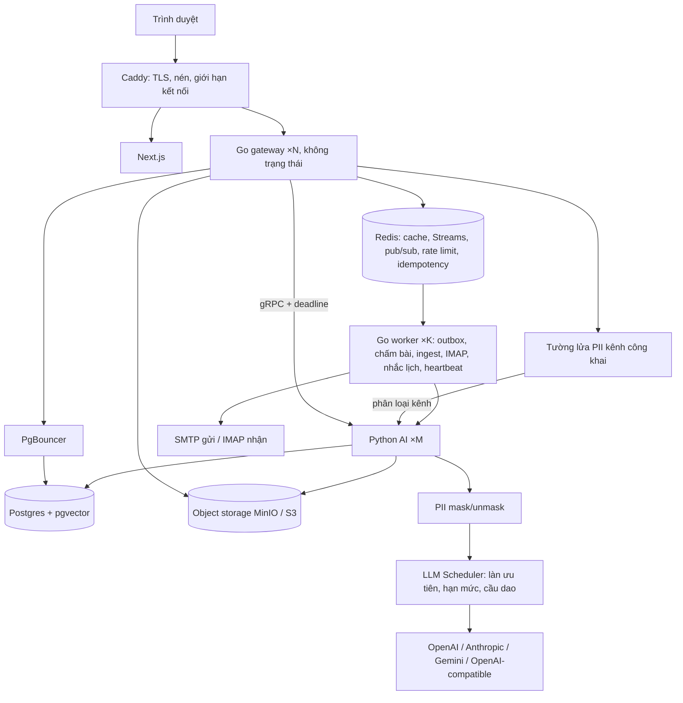

# EduPilot v2 — Kiến trúc và hợp đồng kỹ thuật

Tài liệu tra cứu cho Claude Code. Yêu cầu nghiệp vụ ở `PRD.md`; việc cần làm ở `phases/`; lý do thiết kế, ước lượng tải và SLO ở `SYSTEM_DESIGN.md`; chuẩn giao diện ở `UX.md`.

## 1. Tổng quan



| Thành phần | Nằm ở | Trách nhiệm |
| --- | --- | --- |
| Go Gateway | `backend-go/cmd/gateway` | REST, SSE, auth, RBAC, nghiệp vụ, gRPC client |
| Go Worker | `backend-go/cmd/worker` | Consumer Redis Streams: `grading.jobs`, `mail.inbound`, `mail.outbox`, `reminder.jobs`, `reindex.jobs`, `heartbeat.rollup`; cron; retry 3 lần → dead-letter |
| LLM Gateway + Scheduler | `src/llm/` | `chat`, `stream`, `structured(json_schema)`, `embed`; chọn model theo task từ DB; fallback; ghi `llm_audit`; bọc `mask`/`unmask`. `scheduler.py`: ba làn ưu tiên, token bucket RPM/TPM trên Redis, semaphore, cầu dao, deadline, hàng chờ có giới hạn (back pressure), suy giảm sang trả lời trích xuất |
| Blob | `internal/platform/blob` | Giao diện `Put/Get/PresignPut/PresignGet/Delete`; MinIO (dev, tự host) hoặc S3; DB chỉ lưu khoá object |
| Outbox | `internal/platform/outbox` | Ghi nghiệp vụ + dòng `outbox` trong cùng transaction; worker phát thông báo, mail, sự kiện vô hiệu cache; at-least-once + khử trùng |
| PII | Go `internal/privacy` + Python `src/privacy/` | Go: regex + từ điển roster ở middleware kênh công khai. Python: phân loại kênh, `redact`, `mask`, `unmask`, `unmask_stream` |
| Grading Engine | `src/grading/` | Trích văn bản (docling), bỏ tên/MSSV, chấm theo rubric ra JSON schema, hai lượt |
| Quiz Engine | `internal/quiz` | Chấm trắc nghiệm/đúng–sai/trả lời ngắn bằng code; dùng cho QUIZ, import Forms, luyện đề |
| Grade Engine | `internal/grade` | Tính điểm decimal từ `grade_components` + `grade_rules`; snapshot; XLSX |
| Mail | `internal/mail` | go-mail + `html/template` gửi qua `mail_outbox`; go-imap poll 60 s chỉ để nhận bài nộp |
| Notify | `internal/notify` | Bảng `notifications` + SSE `/notifications/stream` |
| Submission Sources | `internal/submission/source` | `SubmissionSource`: `ImapSource`, `UploadSource`, `FormsImportSource`, `InAppSource` (mặc định), `TeamsGraphSource` (cờ; địa chỉ Graph cấu hình được) |
| mock-graph | `backend-go/cmd/mock-graph` (chỉ có ở compose local) | Giả lập token endpoint + Education API của Microsoft Graph theo đúng ví dụ tài liệu; 7 kịch bản lỗi bật được; nhật ký request cho test. Adapter không biết mình đang nói chuyện với bản giả |

## 2. Cấu trúc `backend-go`

```text
backend-go/
  cmd/gateway/main.go
  cmd/worker/main.go
  cmd/mock-graph/main.go   # chỉ dùng cho dev/test
  internal/
    platform/     # config env, slog, otel, redis, crypto AES-GCM, clock
    auth/         # JWT, bcrypt, RBAC, CourseAccessGuard
    httpapi/      # router chi, middleware, mã lỗi, DTO chung, validation
    sse/
    aiclient/     # gRPC client sinh từ shared-proto
    privacy/
    store/        # sqlc: queries/*.sql → generated
    jobs/
    contract/     # contract test với testdata/golden
    chat/ thread/ document/ analytics/ assignment/ user/      # port từ Java
    course/ crm/ grade/ quiz/ submission/ escalation/ notify/ mail/
    calendar/ library/ insight/ llmconfig/ activity/ observability/ today/
  db/migrations/  # goose: 00001–00026 = V1–V26 nguyên văn; mới từ 00027
  api/openapi.yaml
  testdata/golden/
  sqlc.yaml  Dockerfile  Makefile
```

Mỗi module: `handler.go` (mỏng) · `service.go` (logic, transaction, audit) · `repo.go` (gọi sqlc) · `*_test.go`.

## 3. Thư viện được phép

| Việc | Go | Thay cho (Java) |
| --- | --- | --- |
| Router | `go-chi/chi` v5 | Spring MVC |
| DB | `jackc/pgx` v5 + `sqlc` + `pgvector-go` | JPA/Hibernate |
| Migration | `pressly/goose` | (chưa có) |
| Auth | `golang-jwt/jwt` v5 + `x/crypto/bcrypt` | Spring Security |
| Validation | `go-playground/validator` | Bean Validation |
| Redis | `redis/go-redis` v9 | Spring Data Redis |
| gRPC | `google.golang.org/grpc` + `protoc-gen-go` | grpc-java |
| SSE | `net/http` + `http.Flusher` | SseEmitter |
| Mail gửi / nhận | `wneessen/go-mail` + `html/template` / `emersion/go-imap` v2 + `go-message` | Spring Mail + Thymeleaf / Jakarta Mail |
| XLSX | `xuri/excelize` v2 | Apache POI |
| Thập phân | `shopspring/decimal` | BigDecimal |
| Cron | `robfig/cron` v3 | @Scheduled |
| OpenAPI | `oapi-codegen` | springdoc |
| Quan sát | OpenTelemetry Go + `log/slog` | Micrometer |
| Object storage | `minio/minio-go` v7 (tương thích S3) | Ghi file ra volume |
| Test | `testing` + `testify` + `testcontainers-go` + API MailHog | JUnit, Testcontainers, GreenMail |

Python thêm: `litellm` (lớp dịch provider), `underthesea` hoặc tương đương cho NER tiếng Việt (bật bằng `PII_NER_ENABLED`). Frontend giữ: Next.js, React, zustand (chỉ trạng thái UI + phiên), tailwind, recharts; thêm `@tanstack/react-query`, `@tanstack/react-virtual`, `lucide-react` (thư viện icon DUY NHẤT), font Be Vietnam Pro qua `next/font`, Playwright, `@axe-core/playwright`, Lighthouse CI.
Hạ tầng thêm trong compose: Caddy, PgBouncer, MinIO, MailHog, mock-graph (chỉ local). Test tải: k6.

## 4. Lược đồ dữ liệu mới

Mọi bảng: UUID, `created_at`, `updated_at`; bảng nghiệp vụ có `course_id`. Không sửa migration đã merge.

| Migration | Phase | Nội dung |
| --- | --- | --- |
| 00027 course_foundation | P2 | `courses(subject_code, class_code UNIQUE, name, semester, status ACTIVE/ARCHIVED, escalation_threshold, settings jsonb, join_code CHAR(7) UNIQUE, join_enabled, join_expires_at, join_require_approval, allowed_email_domain, capacity, created_by)`; `enrollments(course_id, user_id, role_in_course TEACHER/TA/STUDENT, status PENDING/ACTIVE/REMOVED, joined_via ADMIN/ROSTER/CODE, student_code_snapshot)` UNIQUE(course, user); `class_sessions(course_id, session_no, starts_at, ends_at, room, topic)`; `notifications(user_id, course_id, type, title, body, link, read_at)` (bảng tạo ở đây; đẩy SSE + mail đến ở P4); `document_courses(document_id, course_id)` + `content_chunks.course_ids uuid[]` (GIN) để chia sẻ tài liệu giữa các lớp không nhúng lại; thêm `TEACHER` vào `user_role`; `course_id` + backfill cho `assignments`, `forum_threads`, `chat_sessions`
| 00028 llm_config | P1 | `llm_providers(type, name, base_url, api_key_enc, enabled)`; `llm_models(provider_id, model, kind, dims, price_in, price_out)`; `llm_task_routes(task, model_id, fallback_order, params jsonb)`; `llm_audit(task, provider, model, tokens_in, tokens_out, latency_ms, pii_masked_count, status, user_id, course_id, trace_id)` |
| 00029 privacy | P3 | `pii_events(course_id, session_id, user_id, channel, pii_type, count, action BLOCKED/REDACTED/SWITCHED/MASKED)` |
| 00030 escalation_notify | P4 | `escalation_tickets(course_id, source_type, source_id, message_id UNIQUE, student_id, status, confidence, claimed_by, answer, answered_at, save_as_knowledge)`; (`notifications` đã tạo ở 00027); `mail_outbox(to_addr, template, payload jsonb, status, attempts, last_error)`; `mail_inbound(message_uid UNIQUE, from_addr, subject, received_at, status)`; `user_settings.notify_ticket_by_mail` |
| 00031 crm | P5 | `attendance_records(session_id, student_id, status, note, marked_by)` UNIQUE(session, student); `participation_events(course_id, student_id, session_id, type, points numeric(4,2), note, created_by)`; `student_observations(course_id, student_id, author_id, tags text[], body)`; `audit_log(actor_id, entity, entity_id, action, before jsonb, after jsonb)` |
| 00032 gradebook | P6 | `grade_schemes(course_id, status DRAFT/CONFIRMED, source_document_id, extraction jsonb, confirmed_by, confirmed_at)`; `grade_components(scheme_id, name, grp QT/CK, weight numeric)`; `grade_rules(scheme_id, kind BONUS/PENALTY/ROUNDING/FAIL_CONDITION/LETTER_SCALE, params jsonb, source_quote)`; `grade_items(component_id, name, max_score, assignment_id)`; `grade_entries(item_id, student_id, score numeric(5,2), source MANUAL/AI_GRADED/QUIZ/IMPORT, published)`; `final_grade_snapshots(course_id, student_id, breakdown jsonb, numeric_grade, letter, locked_at)` |
| 00033 submissions_grading | P7 | `assignments` + `type ESSAY/QUIZ`, `reference_answer`, `rubric jsonb`, `grade_item_id`, `submission_code`; `submissions` + `source`, `version`, `blob_key`, `extracted_text`, `match_status`, `received_at`; `grading_results(submission_id, run_no, criteria_scores jsonb, total, feedback, confidence, flags jsonb, model, status DRAFT/REVIEWED/PUBLISHED, reviewed_by)` |
| 00034 question_bank | P9 | `question_bank(course_id, type, topic, difficulty, stem, answer_key jsonb, explanation, citations jsonb, origin EXTRACTED/GENERATED/MANUAL, review_status)`; `question_options`; `practice_exams`; `practice_attempts(student_id, mode, started_at, submitted_at, score, assignment_id NULL)`; `practice_answers` |
| 00035 documents_library | P8 | `documents` + `visible_to_students`, `use_for_rag`, `category`, `week_no`, `download_count`; type thêm `COURSE_POLICY`, `EXAM_PAPER`, `ANSWER_KEY`; `content_chunks.audience`; CHECK: `ANSWER_KEY` ⇒ `visible_to_students=false` |
| 00036 calendar | P8 | `calendar_events(course_id, type, title, starts_at, ends_at, location, ref_type, ref_id)`; `reminder_log`; `users.ics_token` |
| 00037 integrations | P7 | `integration_configs(course_id, kind IMAP/SMTP/TEAMS, config_enc, enabled, last_sync_at, last_error)` |
| 00038 indexes_views | P5–P10 | Index `(course_id, student_id)`; view `v_student_360`, `v_attendance_summary` |
| 00041 auth_hardening | P2 | `auth_sessions(user_id, refresh_hash, user_agent, ip, expires_at, revoked_at)`; `auth_tokens(user_id, kind VERIFY_EMAIL/RESET_PASSWORD/INVITE, token_hash, expires_at, used_at)`; `users.email_verified_at`, `users.failed_logins`, `users.locked_until`, `users.status`; `login_attempts` |
| 00042 moderation_appeals | P4, P7 | `post_reports(post_id, reporter_id, reason)`; `forum_posts.hidden_at`, `hidden_reason`; `escalation_tickets.kind QUESTION/GRADE_APPEAL/TEACHER_OUTREACH`, `appeal_payload jsonb`; `assignments.appeal_days`, `allow_late`, `channels text[]`, `published_at`; `final_grade_snapshots.version`, `unlock_reason`; `llm_budgets(scope, course_id, daily_limit, monthly_limit)`; `quiz_locks` dùng Redis |
| 00043 production | PR | `consents`, `retention_policies`, `data_requests(user_id, kind EXPORT/DELETE, status)`, `course_features(course_id, chat, thread_auto_answer, auto_grading)`, `courses.archived_at` |
| 00040 platform | PG, P4 | `outbox(id, topic, payload jsonb, created_at, dispatched_at)`; `jobs(id, kind, status, progress, result jsonb, owner_id)`; cột `version int` cho `grade_entries`, `attendance_records`, `grade_schemes`, `grading_results`; `chat_messages.partial_content`, `chat_messages.stream_status`; `documents.blob_key` thay đường dẫn file cục bộ |
| 00039 observation | P5, P10 | `study_time_daily(course_id, student_id, date, area, active_seconds)` UNIQUE(student, date, area); `insight_reports(course_id, kind, period_from, period_to, payload jsonb, data_watermark, generated_by)`; `courses.settings.study_time_weekly_threshold_minutes`; `users.tracking_notice_ack_at` |

Thứ tự số migration theo thứ tự phase thực thi (00028 chạy trước 00027 là chấp nhận được với goose nếu tạo đúng thứ tự thời gian; khi thi công, đánh số tăng dần theo lúc tạo và ghi ánh xạ vào `PROGRESS.md`).

Mã hoá: `APP_ENCRYPTION_KEY` (32 byte base64), AES-256-GCM, IV ngẫu nhiên mỗi bản ghi, cho `api_key_enc` và `config_enc`.

## 5. REST (dưới `/api/v1`, phần lớp dưới `/courses/{courseId}`)

| Nhóm | Endpoint chính | Quyền ghi |
| --- | --- | --- |
| Tài khoản | `POST /auth/register` (chỉ STUDENT), `POST /auth/verify-email`, `POST /auth/resend-verification`, `POST /auth/login`, `POST /auth/refresh`, `POST /auth/logout`, `POST /auth/forgot-password`, `POST /auth/reset-password`, `POST /auth/accept-invite`, `GET/DELETE /me/sessions` | – |
| Quản trị lớp | `GET/POST /admin/courses`, `PUT /admin/courses/{id}`, `POST /admin/courses/{id}/assign {teacher_id, ta_ids[]}`, `POST /admin/courses/{id}/archive`; `GET/POST /admin/users`, `PATCH /admin/users/{id}` (vai trò, khoá) | ADMIN |
| Lớp | `GET /me/courses`, `GET /courses/{id}`, `GET …/sessions`, `PUT …/settings`, `POST …/roster/import`, `POST …/share-from {source_course_id, what[]}` | TEACHER |
| Mã tham gia | `GET …/join-code`, `POST …/join-code/regenerate`, `PUT …/join-settings {enabled, expires_at, require_approval, allowed_email_domain, capacity}` | TEACHER |
| Thành viên | `GET …/members?status=`, `POST …/members/{uid}/approve`, `POST …/members/{uid}/reject`, `DELETE …/members/{uid}` | TA duyệt; TEACHER xoá |
| Tham gia lớp | `POST /courses/join/preview {code}` → `{name, class_code, teacher, semester}`; `POST /courses/join {code}` (idempotent; 5 lần / 10 phút; lỗi đồng nhất `JOIN_CODE_INVALID`) | STUDENT |
| Buổi học | `POST …/sessions/generate {weekdays, start_time, end_time, room, from, to, exclude_dates[]}`, `PUT/DELETE …/sessions/{sid}` | TA, TEACHER |
| Điểm danh | `GET/PUT …/sessions/{sid}/attendance` (cả lưới), `GET …/students/{uid}/attendance` | TA, TEACHER |
| Tham gia | `POST/GET …/participation`, `DELETE …/participation/{id}` | TA, TEACHER |
| Observation SV | `POST/GET …/students/{uid}/observations`, `POST …/students/{uid}/ai-summary` | TA, TEACHER |
| Hôm nay | `GET /me/today`, `GET …/today` | – |
| Hồ sơ | `GET …/students`, `GET …/students/{uid}/profile`, `GET /me/profile`, `GET …/analytics/class-overview` | – |
| Công thức điểm | `POST …/grade-scheme/extract`, `GET/PUT …/grade-scheme`, `POST …/grade-scheme/confirm`, `GET …/grade-scheme/status` | TEACHER |
| Sổ điểm | `POST …/grade-entries/import` (XLSX: preview → commit), `POST …/gradebook/unlock {reason}`, `GET …/gradebook`, `PUT …/grade-entries`, `GET …/gradebook/preview`, `POST …/gradebook/finalize` (409 nếu chưa CONFIRMED), `GET …/gradebook/export.xlsx`, `GET /me/grades` | TEACHER |
| Bài tập | `GET/POST …/assignments`, `GET/PUT/DELETE …/assignments/{aid}`, `POST …/assignments/{aid}/publish`; sinh viên: `GET …/assignments/{aid}/mine` (trạng thái nộp, điểm đã công bố, nhận xét), `POST …/assignments/{aid}/submit` (presign → complete, `Idempotency-Key`), `POST …/assignments/{aid}/appeal` | TEACHER tạo; STUDENT nộp |
| Bài tập / bài nộp | `PUT …/assignments/{aid}/rubric`, `POST …/assignments/{aid}/rubric/suggest`, `POST …/assignments/{aid}/submissions/upload`, `POST …/assignments/{aid}/forms-import`, `GET …/submissions?match_status=`, `PUT …/submissions/{id}/match` | TA, TEACHER |
| Chấm | `POST …/assignments/{aid}/grade-all`, `POST …/submissions/{id}/grade`, `GET/PUT …/grading-results/{id}`, `POST …/grading-results/publish` | Publish: TEACHER |
| Escalation | `GET …/tickets`, `POST …/tickets/{id}/claim`, `POST …/tickets/{id}/answer`, `POST /chat/messages/{mid}/escalate` | TA, TEACHER |
| Thông báo | `GET /notifications`, `POST /notifications/{id}/read`, `GET /notifications/stream` (SSE) | – |
| Kiểm duyệt Threads | `POST …/posts/{id}/report`, `POST …/posts/{id}/hide {reason}`, `PUT/DELETE …/posts/{id}` (chủ bài) | TA, TEACHER ẩn |
| Threads (bổ sung) | `POST …/threads/precheck` → `{allowed, reasons[], redacted_text}`; `POST /chat/sessions/from-draft` | – |
| Luyện đề | `GET/POST …/questions`, `POST …/questions/extract`, `POST …/questions/generate`, `PUT …/questions/{id}/review`, `POST …/practice/start`, `POST …/practice/{attemptId}/answer`, `POST …/practice/{attemptId}/submit`, `GET …/practice/history` | Review: TA, TEACHER |
| Thư viện | `GET …/library`, `GET …/library/{docId}/download`, `PATCH …/documents/{id}` | TA, TEACHER |
| Lịch | `GET …/calendar?from=&to=`, `POST/PUT/DELETE …/calendar/events`, `GET /calendar/feed.ics?token=` | TA, TEACHER |
| Thời gian học | `POST /activity/heartbeat {area, tab_id}`, `GET …/students/{uid}/study-time?weeks=`, `GET …/analytics/study-time?week=`, `GET /me/study-time`, `POST /me/tracking-notice/ack` | – |
| Insight | `POST …/insights/knowledge-gap/generate`, `GET …/insights/knowledge-gap/latest`, `GET …/insights/knowledge-gap/{id}/export` | TA, TEACHER |
| Ngân sách LLM | `GET/PUT /admin/llm/budget`, `GET/PUT …/llm-budget` | ADMIN |
| LLM | `GET/POST/PUT/DELETE /admin/llm/providers`, `POST /admin/llm/providers/{id}/test`, `GET/PUT /admin/llm/routes`, `GET /admin/llm/usage` | ADMIN |
| Observability | `GET /admin/observability/summary`, `GET /admin/observability/requests`, `GET /admin/observability/requests/{id}` (ghi `audit_log` mỗi lần mở), `GET …/observability/summary` (tổng hợp theo lớp, không có nội dung) | ADMIN; TEACHER chỉ bản tổng hợp |
| Quản trị (PR) | `GET /admin/audit`, `GET /admin/health`, `PUT /admin/courses/{id}/features`, `POST …/archive`, `POST …/export`, `POST …/clone-to {semester}`; `GET/POST /me/privacy/export`, `POST /me/privacy/delete-request`, `GET/POST /me/consents` | ADMIN / bản thân |
| Tích hợp | `GET/PUT …/integrations/{kind}`, `POST …/integrations/{kind}/test`, `POST …/integrations/imap/sync-now` | ADMIN, TEACHER |

Lỗi thống nhất: `{code, message, details?, retry_after?}`; 401 chưa đăng nhập, 403 sai quyền/ngoài lớp, 409 xung đột trạng thái hoặc phiên bản, 422 validation, 429 rate limit, 503 quá tải (kèm `retry_after`).

### Quy ước cho MỌI API mới (từ P2)

| Quy ước | Chi tiết |
| --- | --- |
| Phân trang con trỏ | `?cursor=&limit=` (mặc định 30, tối đa 100) → `{items, next_cursor}`; sắp theo `(created_at, id)` |
| Idempotency | Header `Idempotency-Key` bắt buộc cho: trả lời ticket, công bố điểm, chốt điểm, xác nhận công thức, nộp bài thi thử/QUIZ, upload bài nộp, tạo báo cáo. Lưu Redis 24 h, trả lại đúng response cũ |
| Khoá lạc quan | Tài nguyên sửa đồng thời được (`grade_entries`, `attendance_records`, `grade_schemes`, `grading_results`) có cột `version`; ghi sai phiên bản → 409 kèm giá trị hiện tại |
| Việc dài | `202 {job_id}`; `GET /jobs/{id}`; tiến độ đẩy qua SSE sự kiện `job.progress` |
| Cache HTTP | `ETag` + `If-None-Match` cho lịch, thư viện, công thức điểm, danh sách lớp |
| File | `POST …/uploads/presign` → client PUT thẳng lên object storage → `POST …/uploads/complete`; tải xuống qua URL ký sẵn 5 phút sau khi kiểm quyền |
| Thời hạn | Gateway đặt deadline cho mỗi request; truyền qua gRPC; client huỷ thì huỷ luôn lời gọi LLM |
| SSE | Sự kiện có `id`; hỗ trợ `Last-Event-ID`; tối đa 2 kết nối mỗi người; heartbeat comment mỗi 25 s |

API cũ của Project III giữ nguyên trong phase PG (hợp đồng bất biến); được nâng lên quy ước này khi module tương ứng được đụng tới ở phase sau, có cập nhật frontend đi kèm.

## 6. gRPC (`shared-proto`)

| Service | RPC | Ghi chú |
| --- | --- | --- |
| `AIThreadService` (có sẵn) | `StreamAIResponse`, `SuggestSimilarThreads`, `ClassifyIntent` | Sau PG mới được thêm trường optional: request `course_id`, `channel`; metadata `confidence`, `pii_masked_count`, `should_escalate`, `no_context` |
| `AIDocumentService` (có sẵn) | `ProcessDocument`, `UpdateChunkContent` | Thêm `document_type`, `audience` |
| `AIPrivacyService` | `ClassifyChannel(text)`, `Redact(text, roster_key)` | Gateway gọi khi tường lửa Go chưa chắc |
| `AIGradingService` | `SuggestRubric`, `GradeSubmission`, `GenerateFeedbackSummary`, `ExtractGradeScheme(document_id)` | Worker Go gọi; trả JSON theo schema cố định |
| `AIQuestionService` | `ExtractQuestions(document_id)`, `GenerateQuestions(topic, n, types)`, `ExplainAnswer` (stream) | Kết quả luôn ở trạng thái chờ duyệt |
| `AIInsightService` | `GenerateKnowledgeGapReport(course_id, from, to, items[])` | Go gom dữ liệu đã che; Python gom cụm, gắn chương, viết khuyến nghị |
| `AIAdminService` | `TestProvider`, `ReloadConfig`, `StartReindex` | `ReloadConfig` cũng kích bằng pub/sub `llm.config.changed` |

Tool agent mới (`src/tools.py`, chỉ kênh riêng): `get_my_attendance`, `get_my_participation`, `get_my_grade_summary`, `what_if_final_grade`, `get_exam_schedule`, `get_upcoming_events`; cả hai kênh: `search_library`.
Python đọc bảng nghiệp vụ chỉ qua view/truy vấn chỉ-đọc; không ghi.

## 7. Frontend

| Route | Màn hình | Vai trò | Phase |
| --- | --- | --- | --- |
| `/` | Hôm nay theo vai trò (M14) | Tất cả | PU (khung), P2 (dữ liệu xếp hạng) |
| `/login`, `/register`, `/profile`, `/settings` | Dựng lại theo `DESIGN.md` | Tất cả | PU |
| `/join`, `/join/[code]` | Nhập mã → xem trước lớp → tham gia | STUDENT | P2 |
| `/class/members`, `/class/settings` | Thành viên, yêu cầu chờ duyệt, mã tham gia, cài đặt lớp (mở từ bộ chọn lớp → "Quản lý lớp này", không thêm mục sidebar) | TA, TEACHER | P2 |
| `/admin/courses`, `/admin/users` | Mở lớp, gán giảng viên / TA, tài khoản giảng viên | ADMIN | P2 |
| `/dev/ui` | Trưng bày primitive × trạng thái (chỉ môi trường dev) | – | PU |
| `/chat` | Chat riêng: nhãn đã ẩn PII, thanh tự tin, "Cần hỗ trợ" | STUDENT | P3 |
| `/threads`, `/threads/[id]` | Threads + Verify + hộp thoại tường lửa | Tất cả | P3, P4 |
| `/inbox` | Hàng chờ escalation, trả lời trong app | TA, TEACHER | P4 |
| `/students`, `/students/[id]` | CRM + hồ sơ 360 (gộp `/at-risk`) | TA, TEACHER | P5 |
| `/attendance` | Lưới điểm danh + ghi phát biểu | TA, TEACHER | P5 |
| `/me` | Điểm, chuyên cần, điểm cộng, thời gian học, giải trình điểm | STUDENT | P5, P6 |
| `/gradebook`, `/gradebook/scheme` | Sổ điểm; xác nhận công thức từ quy chế | TEACHER | P6 |
| `/grading`, `/grading/[submissionId]` | Hai tab: **Bài tập** (tạo / sửa / công bố bài) và **Hàng chờ chấm** (khớp tay, duyệt cạnh nhau, công bố điểm, phúc khảo) | TA, TEACHER | P7 |
| `/assignments/[id]` | Sinh viên: đề bài, nộp bài, trạng thái, điểm + nhận xét đã công bố, `Yêu cầu xem lại`. Vào từ Hôm nay, Lịch, Kết quả của tôi — không thêm mục sidebar | STUDENT | P7 |
| `/verify-email`, `/forgot-password`, `/reset-password`, `/invite/[token]` | Luồng tài khoản F1 | Tất cả | P2 |
| `/settings/privacy`, `/help`, `/admin/audit`, `/admin/health` | Quyền dữ liệu cá nhân, trợ giúp, kiểm toán, sức khoẻ hệ thống | – | PR |
| `/documents` | Upload + cờ RAG/hiển thị + loại mới | TA, TEACHER | P8 |
| `/library` | Thư viện sinh viên | Tất cả | P8 |
| `/calendar` | Lịch + ICS | Tất cả | P8 |
| `/questions` | Ngân hàng câu hỏi + duyệt | TA, TEACHER | P9 |
| `/practice`, `/practice/[attemptId]`, `/practice/history` | Luyện đề, thi thử, làm bài QUIZ | STUDENT | P9 |
| `/insights` | Báo cáo lỗ hổng kiến thức | TA, TEACHER | P10 |
| `/observability` | Quan sát hệ thống AI (TEACHER chỉ thấy tổng hợp của lớp mình, không có nội dung prompt) | ADMIN, TEACHER | P10 |
| `/settings/llm`, `/settings/integrations` | Provider/model; SMTP/IMAP/Teams | ADMIN | P1, P7 |
| `/analytics` | Giữ; thêm thẻ escalation, PII, chi phí | TA, TEACHER | P10 |

Hợp đồng bố cục từng route: `design/DESIGN.md` §14. Cấu trúc frontend:

```text
frontend/src/
  shared/
    styles/tokens.css        # nguồn token duy nhất (từ design/DESIGN_TOKENS.css)
    ui/                      # primitive: AppShell, Sidebar, TopBar, PageHeader, Section, ActionList, Toolbar, DataTable,
                             #   Tabs, SegmentedControl, InlineNotice, StatusText, Field, EmptyState, Skeleton, Drawer, Dialog, Composer…
    domain/                  # PIIProtectionNotice, CitationList, VerificationState, EscalationRow, StudentRiskSummary, AttendanceGrid,
                             #   GradeCalculation, GradeSchemeReview, SubmissionReview, QuestionReview, KnowledgeGapTopic, LLMRouteTable, RequestTraceDetail
    data/                    # apiClient, query client, useSSE, useAutosaveDraft, useUndoableAction
    i18n/vi.ts               # chuỗi hiển thị + bảng dịch khái niệm (DESIGN.md §13)
  features/<module>/         # lắp ghép từ shared/, không tự tạo primitive
  app/                       # route
frontend/public/brand/       # logo-edupilot.svg, logo-edupilot-mark.svg, favicon.svg
```

Toàn cục: chuông thông báo; bộ chọn lớp; banner nhắc công thức điểm (TEACHER/TA); hook `useActivityHeartbeat(area)` ở layout; hộp thoại minh bạch theo dõi thời gian (STUDENT, một lần).

## 8. Biến môi trường mới

| Biến | Dùng cho |
| --- | --- |
| `DATABASE_URL`, `REDIS_URL`, `JWT_SECRET_KEY`, `JWT_EXPIRATION`, `PYTHON_GRPC_URL`, `APP_CORS_ALLOWED_ORIGINS` | Gateway Go (giữ tên cũ của Java khi có thể) |
| `APP_ENCRYPTION_KEY` | AES-GCM |
| `ACCESS_TOKEN_TTL` (15m), `REFRESH_TOKEN_TTL` (14d), `COOKIE_DOMAIN` | Phiên đăng nhập |
| `SUPPORT_RESOURCES_VI` | Thông tin hỗ trợ sinh viên do trường cung cấp (F3) |
| `OIDC_ENABLED`, `OIDC_ISSUER`, `OIDC_CLIENT_ID`, `OIDC_CLIENT_SECRET` | Đăng nhập bằng tài khoản trường, mặc định tắt (PR) |
| `CLAMAV_URL`, `BACKUP_TARGET`, `ALERT_EMAIL` | Quét file, sao lưu, cảnh báo (PR) |
| `BLOB_ENDPOINT`, `BLOB_BUCKET`, `BLOB_ACCESS_KEY`, `BLOB_SECRET_KEY`, `BLOB_USE_SSL` | Object storage (dev → MinIO) |
| `PGBOUNCER_URL`, `DB_MAX_CONNS` | Pool kết nối |
| `LLM_MAX_CONCURRENCY`, `LLM_BATCH_SHARE`, `LLM_QUEUE_MAX` | Scheduler: luồng đồng thời, phần hạn mức tối đa cho làn BATCH (mặc định 0,5), độ dài hàng chờ INTERACTIVE |
| `GRADING_WORKERS`, `INGEST_WORKERS` | Số consumer đồng thời |
| `APP_PUBLIC_URL` | Deep link mail, ICS |
| `SMTP_HOST`, `SMTP_PORT`, `SMTP_USER`, `SMTP_PASS`, `MAIL_FROM` | Gửi mail (dev → MailHog 1025) |
| `IMAP_HOST`, `IMAP_USER`, `IMAP_PASS`, `IMAP_POLL_SECONDS` | Nhận bài nộp |
| `TEAMS_ENABLED`, `TEAMS_TENANT_ID`, `TEAMS_CLIENT_ID`, `TEAMS_CLIENT_SECRET` | Adapter Teams; production mặc định tắt, dev mặc định bật và trỏ vào mock-graph |
| `GRAPH_BASE_URL`, `GRAPH_AUTH_URL` | Thật: `https://graph.microsoft.com/v1.0`, `https://login.microsoftonline.com`. Dev: `http://mock-graph:8090/v1.0`, `http://mock-graph:8090` |
| `PII_NER_ENABLED` | Tầng NER |
| `SEED_ON_EMPTY_DB`, `SEED_DEFAULT_PASSWORD` | Seed |
| `OPENAI_API_KEY`, `ANTHROPIC_API_KEY`, `GEMINI_API_KEY` | Chỉ dự phòng khi `llm_providers` trống |

## 9. Seed (`scripts/seed.mjs`, idempotent, gọi API thật theo đúng luồng: Admin mở lớp → gán giảng viên → sinh viên vào lớp)

Một giảng viên phụ trách **hai lớp cùng học phần An ninh mạng**, mỗi lớp 30 sinh viên. Hai lớp cố ý ở hai trạng thái khác nhau để demo được nhiều tình huống.

| | Lớp 1 — mã lớp `761987` | Lớp 2 — mã lớp `761988` |
| --- | --- | --- |
| Trạng thái | Đang chạy giữa kỳ, tuần 10 | **Mới được phân công**: thông báo nhận lớp còn chưa đọc, việc "Thiết lập lớp mới" đang mở |
| Sinh viên | 30, vào bằng import danh sách | 30: 24 đã vào bằng mã, 3 **đang chờ duyệt** (lớp này bật yêu cầu duyệt), còn 3 chỗ trống để demo nhập mã trực tiếp |
| Công thức điểm | Đã xác nhận từ quy chế môn học | **Chưa xác nhận** → banner nhắc nhở, nút Chốt điểm bị khoá |
| Tài liệu | 6 bài giảng, 1 quy chế trường, 1 quy chế môn học, 2 đề cũ, 2 đáp án | Chia sẻ từ lớp 1 (không nhúng lại), trừ quy chế môn học chưa tải |
| Dữ liệu học | Đầy đủ như bảng dưới; câu hỏi lệch về 2 chủ đề A, B | 3 tuần dữ liệu; câu hỏi lệch về chủ đề C → báo cáo lỗ hổng của hai lớp khác nhau |

3 sinh viên học **cả hai lớp** (57 tài khoản sinh viên riêng biệt) để kiểm bộ chọn lớp phía sinh viên và kiểm cách ly dữ liệu giữa hai lớp.

| Tài khoản | Vai trò | Email | Hồ sơ |
| --- | --- | --- | --- |
| Admin | ADMIN | `admin@edupilot.local` | Đã mở 2 lớp và gán giảng viên; cấu hình LLM, tích hợp |
| Giảng viên | TEACHER | `teacher@edupilot.local` | Phụ trách lớp 1 và lớp 2; có 1 thông báo nhận lớp chưa đọc |
| Sinh viên A | STUDENT | `sv.gioi@edupilot.local` | Lớp 1 + lớp 2. Chuyên cần 100%, nhiều điểm cộng |
| Sinh viên B | STUDENT | `sv.kha@edupilot.local` | Lớp 1. Vắng 2, có bài nộp muộn |
| Sinh viên C | STUDENT | `sv.nguyco@edupilot.local` | Lớp 1. Vắng 5, thiếu bài, thời gian học dưới ngưỡng 3 tuần → cần chú ý |
| Sinh viên D | STUDENT | `sv.moi@edupilot.local` | **Chưa vào lớp nào** → dùng để demo nhập mã tham gia lớp 2 |

Các sinh viên còn lại: tên sinh ngẫu nhiên, MSSV `2022xxxx` không trùng MSSV thật, cùng mật khẩu `SEED_DEFAULT_PASSWORD`. Mã tham gia seed cố định để viết kịch bản demo: lớp 1 `AN7K2MQ`, lớp 2 `BX4P9TW`.

Dữ liệu của **lớp 1** (lớp 2 có phiên bản rút gọn 3 tuần):

| Dữ liệu | Số lượng |
| --- | --- |
| Buổi học | 15 (10 đã diễn ra) |
| Điểm danh | 300 bản ghi, vắng TB ≈ 8% |
| Phát biểu | ≈ 60, phân bố lệch |
| Bài tập | 3 ESSAY (đã hết hạn, có đáp án + rubric 4 tiêu chí) + 1 QUIZ đang mở |
| Bài nộp | ≈ 85 file văn bản; 20 bài có điểm chấm tay (E3) |
| Dữ liệu mock-graph | `testdata/mock-graph/`: lớp 1, 4 bài tập, ≈ 25 bài `submitted` + vài bài `working` / `returned` |
| Quy chế môn học | QT 40% / CK 60%; +0,25 mỗi lần phát biểu, trần +1,0; −0,5 mỗi buổi vắng không phép từ buổi thứ 3 |
| Câu hỏi | 80 đã duyệt + 20 chờ duyệt (chia sẻ sang lớp 2) |
| Lịch | 4 deadline, 1 giữa kỳ, 1 cuối kỳ (tương lai) |
| Threads / chat / ticket | 12 thread; ≈ 150 câu hỏi chat lệch về 2 chủ đề + 10 câu ngoài tài liệu; 3 ticket ở ba trạng thái |
| Thời gian học | 10 tuần `study_time_daily` cho 30 sinh viên |
| Đối chiếu | `seed/expected_final_grades.csv` (tính tay, lớp 1) |

## 10. Kiểm thử

| Tầng | Công cụ | Bắt buộc |
| --- | --- | --- |
| Unit Go | `go test`, testify, table-driven | Grade Engine (biên làm tròn), Quiz Engine, khớp bài nộp, RBAC theo lớp, AES-GCM, tường lửa PII |
| Tích hợp Go | testcontainers-go + API MailHog | Escalation → mail; IMAP → bài nộp; finalize; heartbeat |
| Contract | Golden response từ gateway Java | Mọi endpoint cũ; giữ làm hồi quy sau khi xoá Java |
| Unit Python | pytest (provider giả) | detector, phân loại kênh, redact, mask/unmask_stream (token cắt mọi vị trí), gateway, grading parser, tool từ chối hỏi hộ |
| Hồi quy AI | pytest + golden set | Guardrails, injection (chat + bài nộp), citation, lọc `ANSWER_KEY` |
| E2E | Playwright | Hỏi điểm; escalate–trả lời; điểm danh; chấm–công bố; thi thử |
| Đánh giá | `make eval` | E1–E6 |
| Tải | k6 + `scripts/seed-t1.mjs` (1.000 SV, 20 lớp) + provider LLM giả có độ trễ 5–15 s | SLO ở `SYSTEM_DESIGN.md` mục 5; kịch bản hỗn hợp chat + chấm 1.000 bài |
| Hỗn loạn nhỏ | Script giết worker / Redis / Python giữa chừng | 0 việc thất lạc; chat suy giảm đúng kiểu |
| UX | `@axe-core/playwright`, Lighthouse CI (mobile), Playwright ở 375 px và mạng 3G chậm | Cổng UX ở `UX.md` mục 6 |

Test gọi LLM thật gắn marker `llm`, không chạy trên CI. CI sau PG: `go vet`, `golangci-lint`, `go test -race ./...`, `sqlc diff`, `pytest`, frontend lint + build.
