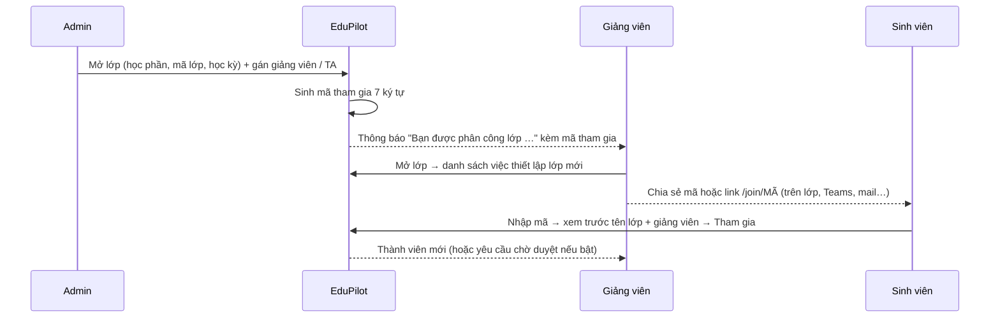

# EduPilot v2 — PRD

Bản hợp nhất ngày 2026-09-20, đã qua một lượt rà soát end-to-end (`FLOWS.md` mục 0). Lý do của từng quyết định xem `DECISIONS.md`. Hành trình trọn vẹn của người dùng xem `FLOWS.md`; điều kiện để trường dùng thật xem `PRODUCTION_READINESS.md`.

## 1. Tóm tắt

EduPilot v2 nâng hệ thống từ "chatbot trợ giảng hỏi–đáp" (Project III) thành nền tảng vận hành lớp học có AI cho một học phần.
Vòng đời khép kín: sinh viên hỏi → AI trả lời hoặc escalate → giảng viên trả lời trong app, thư bắn qua mail → bài nộp được kéo về và chấm →
điểm danh, điểm cộng, điểm thành phần gộp thành điểm cuối kỳ theo quy chế môn học → sinh viên hỏi lại AI về chính dữ liệu đó →
giảng viên xem lớp đang yếu ở đâu để cập nhật giáo trình.

Trục có giá trị học thuật: (1) chấm tự luận tự động theo đáp án + rubric, đo đồng thuận với giảng viên; (2) che danh tính hai chiều trước LLM bên ngoài
kết hợp tường lửa PII hai kênh; (3) LLM Gateway đa provider. Về kỹ thuật, toàn bộ gateway viết lại bằng Go.

## 2. Mục tiêu đo được

| # | Mục tiêu | Chỉ số nghiệm thu |
| --- | --- | --- |
| G1 | Nội dung cá nhân không lọt ra kênh công khai và không ra LLM ở dạng định danh | Recall phát hiện ≥ 95% trên 200 bài; chặn nhầm câu học thuật ≤ 5%; 0 MSSV / họ tên thật trong payload gửi LLM |
| G2 | Escalate đúng lúc | ≥ 90% câu trả lời sai trong golden set bị escalate; escalate nhầm ≤ 25% |
| G3 | Chấm tự luận sát giảng viên | QWK ≥ 0,7; MAE ≤ 1,0 điểm (thang 10) trên ≥ 60 bài chấm tay |
| G4 | Đổi LLM không sửa code | Đổi provider trên UI, chạy lại golden set, mọi luồng vẫn qua |
| G5 | Điểm cuối kỳ đúng tuyệt đối | 30/30 sinh viên seed khớp bảng tính tay; không dùng LLM để tính |
| G6 | Hiệu năng và khả năng mở rộng | Ở tải T1 (1.000 SV, 300 đồng thời): TTFT ≤ 1,5 s (cache hit), ≤ 4 s (RAG); API đọc p95 ≤ 300 ms; dashboard ≤ 3 s; chấm 1.000 bài ≤ 3 giờ mà TTFT chat không xấu đi quá 20%; mở rộng ngang không sửa code. Chi tiết: `SYSTEM_DESIGN.md` |
| G7 | Trải nghiệm | Mọi màn đạt định nghĩa xong của `design/DESIGN.md` §22 và cổng UX (`UX.md` mục 6); 10 câu hỏi nghiệm thu cuối `design/AGENT_PROMPT.md` đều "có"; điểm danh 30 SV trên điện thoại ≤ 60 s; không thao tác nào làm mất chữ đã gõ; LCP mobile ≤ 2,5 s |

### Vì sao dùng dữ liệu mô phỏng

Đây là ràng buộc về chính sách, không phải về kỹ thuật. Một sinh viên làm đồ án không có quyền tự đưa dữ liệu thật vào hệ thống:

| Ràng buộc | Chi tiết | Muốn triển khai thật thì cần |
| --- | --- | --- |
| Dữ liệu cá nhân | Điểm, chuyên cần, câu hỏi của sinh viên là dữ liệu cá nhân theo Luật 91/2025/QH15 (hiệu lực 01/01/2026); trường là bên kiểm soát dữ liệu | Trường và pháp chế chấp thuận; thông báo và sự đồng ý của sinh viên; hồ sơ đánh giá tác động |
| Mô hình AI ở nước ngoài | Gửi dữ liệu thật ra nước ngoài là chuyển dữ liệu xuyên biên giới | Hồ sơ đánh giá tác động chuyển dữ liệu do trường lập, hoặc dùng mô hình tự triển khai trong nước |
| Microsoft Teams | Quyền Graph `EduAssignments.*` bắt buộc admin consent của tenant trường; tài khoản cá nhân không dùng được | Trung tâm CNTT phê duyệt ứng dụng |
| Hệ thống đào tạo | Danh sách lớp và điểm chính thức không có API công khai | Trường cấp quyền hoặc xuất file; EduPilot chỉ là công cụ hỗ trợ, điểm chính thức vẫn ở hệ thống đào tạo |

Hệ thống đã thiết kế sẵn cho ngày được cấp quyền: che tên và MSSV trước mọi lời gọi LLM, provider tự host, adapter Teams kiểm thử với `mock-graph` và bật bằng cấu hình, phase PR cho đồng ý / xuất / xoá dữ liệu và vận hành. Dữ liệu mô phỏng còn giúp thí nghiệm tái lập được. Chi tiết: `PRODUCTION_READINESS.md`, quyết định D44.

Ngoài phạm vi: đồng bộ hai chiều LMS/SIS, ghi điểm về Teams; chạy code sinh viên trong sandbox; đạo văn, proctoring; mobile native; đa trường;
AI tự công bố điểm; nhận reply mail từ hộp thư giảng viên; quy thời gian học on-screen ra điểm.

## 3. Vai trò và quyền

| Chức năng | STUDENT | TA | TEACHER | ADMIN |
| --- | --- | --- | --- | --- |
| Chat riêng, luyện đề, lịch, thư viện | Có | Có | Có | Có |
| Xem điểm, chuyên cần, điểm cộng, thời gian học | Của mình | Cả lớp | Cả lớp | Cả lớp |
| Threads: đăng, trả lời | Có | Có | Có | Có |
| Threads: Verify / Correct / Reject | – | Có | Có | Có |
| Nhận và trả lời escalation | – | Có | Có | – |
| Upload tài liệu, đề, ngân hàng câu hỏi | – | Có | Có | Có |
| Điểm danh, ghi phát biểu, observation | – | Có | Có | – |
| Duyệt điểm AI chấm / Công bố | – | Duyệt nháp | Công bố | – |
| Xác nhận công thức điểm, chốt điểm cuối kỳ | – | – | Có | – |
| Tạo báo cáo lỗ hổng kiến thức | – | Có | Có | – |
| Cấu hình LLM, tích hợp Mail/Teams, observability | – | – | Xem | Có |
| Mở lớp, gán giảng viên / TA, tạo tài khoản giảng viên | – | – | – | Có |
| Xem / tạo lại mã tham gia, duyệt thành viên, mời ra khỏi lớp | – | Xem, duyệt | Có | Có |
| Tham gia lớp bằng mã | Có | – | – | – |

Mọi API đọc dữ liệu cá nhân lọc theo `course_id` và, với STUDENT, theo `user_id` từ JWT — không từ tham số hay nội dung câu hỏi.

## 4. Module

### M0. Lớp học: mở lớp, phân công, mã tham gia
Đơn vị của hệ thống là **lớp** (lớp học phần, có mã lớp riêng). Một giảng viên có thể phụ trách nhiều lớp; một sinh viên có thể học nhiều lớp. Mọi dữ liệu nghiệp vụ mang `course_id`.

- **Tài khoản an toàn (F1):** sinh viên tự đăng ký và phải **xác minh email**; giảng viên / TA nhận **link mời** để tự đặt mật khẩu; quên mật khẩu bằng link một lần; khoá tạm khi dò mật khẩu; phiên ngắn + refresh token xoay vòng trong cookie `httpOnly`, thu hồi được. **MSSV tự khai không bao giờ mở được dữ liệu:** chỉ nối tài khoản vào danh sách lớp khi email đã xác minh trùng email trong danh sách; lệch thì giảng viên duyệt tay.
- **Admin** (`/admin/courses`, `/admin/users`): mở lớp, sửa, lưu trữ; gán / đổi giảng viên và TA (giảng viên cũng tự thêm / bớt TA của lớp mình); tạo tài khoản TEACHER / TA. Admin KHÔNG thêm sinh viên vào lớp. Sinh viên tự đăng ký tài khoản và chỉ có vai trò STUDENT; không ai tự nâng quyền được.
- **Phân công → thông báo:** giảng viên đăng nhập thấy chuông "Bạn được phân công lớp An ninh mạng – 761988" kèm mã tham gia và nút mở lớp. Trên "Hôm nay" hiện việc **Thiết lập lớp mới**: chia sẻ mã lớp → tải quy chế môn học → tạo lịch buổi học → tải tài liệu. Việc này tự biến khi làm xong.
- **Mã tham gia kiểu Teams:** 7 ký tự từ bảng chữ không gây nhầm (bỏ 0/O, 1/I/L), duy nhất toàn hệ thống. Giảng viên xem, sao chép, lấy link `/join/MÃ`, **tạo lại mã** (mã cũ vô hiệu ngay), bật / tắt, đặt ngày hết hạn, giới hạn sĩ số, giới hạn tên miền email, và tuỳ chọn **yêu cầu duyệt** (mặc định tắt: vào lớp ngay như Teams).
- **Sinh viên tham gia:** từ bộ chọn lớp hoặc màn "Hôm nay" khi chưa có lớp → nhập mã → bước **xem trước** (tên lớp, mã lớp, giảng viên, học kỳ) để tránh vào nhầm → `Tham gia lớp`. Tham gia hai lần không tạo bản ghi đôi. Sai mã trả cùng một thông báo cho mọi trường hợp; giới hạn 5 lần thử / 10 phút.
- **Hai đường vào lớp song song:** import danh sách (CSV/XLSX) vẫn giữ cho giảng viên muốn nạp sẵn; sinh viên có trong danh sách import mà tự nhập mã thì được nối vào đúng bản ghi đó.
- **Quản lý lớp** (giảng viên, mở từ bộ chọn lớp → "Quản lý lớp này"): thành viên, yêu cầu chờ duyệt, mời ra khỏi lớp, mã tham gia, cài đặt lớp.
- **Nhiều lớp một giảng viên:** bộ chọn lớp ở thanh trên; riêng "Hôm nay" và "Hộp thư hỗ trợ" có chế độ **Tất cả lớp của tôi**, mỗi việc ghi rõ thuộc lớp nào. Tài liệu, ngân hàng câu hỏi và công thức điểm của một lớp **chia sẻ sang lớp khác cùng học phần** được mà không phải trích và nhúng lại.
- AC: sinh viên ngoài lớp nhận 403 ở mọi API lớp; STUDENT gọi API mở lớp / gán giảng viên nhận 403; thông báo phân công tới giảng viên ≤ 60 s; tạo lại mã thì mã cũ bị từ chối ngay; dữ liệu lớp A không bao giờ xuất hiện trong chat, RAG, báo cáo hay sổ điểm của lớp B. (D45: không migrate dữ liệu Project III.)

### M1. Chat riêng tư, tường lửa PII hai kênh, che danh tính trước LLM
- Hai kênh: **chat riêng** cho thông tin cá nhân (điểm, quy chế áp vào mình, lịch thi, chuyên cần, điểm cộng); **Threads công khai** cho hỏi bài.
- Tường lửa trên Threads (tiêu đề, nội dung, bình luận) trước khi lưu. Bốn tầng: regex (MSSV, email, SĐT, CCCD), từ điển roster lớp, mẫu câu hỏi cá nhân tiếng Việt, LLM phân loại kênh khi mơ hồ.
- Khi chặn: hộp thoại có hai lối — "Chuyển sang chat riêng" (mở phiên mới mang theo bản nháp) và "Che thông tin rồi đăng".
- Tool cá nhân chỉ có ở kênh riêng: `get_my_attendance`, `get_my_participation`, `get_my_grade_summary`, `get_exam_schedule`, `get_upcoming_events`, `what_if_final_grade`. Không tham số danh tính; đọc `trusted_context`.
- Che danh tính hai chiều quanh mọi lời gọi LLM: placeholder ổn định theo phiên (`[[SV_1]]`, `[[MSSV_1]]`, `[[EMAIL_1]]`), ánh xạ trong Redis có TTL, không log. Kết quả tool quay lại LLM cũng được che tên. Khôi phục khi stream có buffer biên placeholder; bộ quét cuối thay placeholder sót bằng "bạn".
- UI: dòng "Đã ẩn N thông tin cá nhân trước khi gửi cho AI" + `Tìm hiểu`; dưới ngưỡng tự tin sinh viên thấy "AI chưa đủ chắc chắn về câu này" + `Nhờ giảng viên hỗ trợ` (không hiện con số); mọi lần chặn/che/chuyển kênh ghi `pii_events`.
- AC: bài Threads chứa MSSV hoặc hỏi điểm cá nhân không bao giờ lưu công khai; hỏi điểm MSSV khác bị từ chối + log; payload LLM không chứa MSSV/họ tên thật; sinh viên không bao giờ thấy chuỗi `[[…]]`.

### M2. Threads chuyên môn + Verify
Giữ luồng Project III (AI Socratic + citation, Verify/Correct/Reject, nạp lại vector DB). Thêm: thông báo khi có câu trả lời AI chờ duyệt, nhãn "Đã được giảng viên xác nhận", lọc tuần/chủ đề, ghim.
Kiểm duyệt: `Báo cáo` bài (3 báo cáo → tự ẩn chờ duyệt), giảng viên / TA `Ẩn bài` kèm lý do, sinh viên sửa / xoá bài của mình (sửa thì chạy lại tường lửa). Người đăng được báo khi có trả lời và khi câu trả lời được xác nhận.
AC: câu trả lời bị Reject không hiện với sinh viên và không còn được RAG truy xuất.

### M3. Escalation, thông báo, thư qua mail
Ticket không ai nhận: nhắc lại cả nhóm sau 24 giờ làm việc, nổi lên đầu "Hôm nay" sau 72 giờ; sinh viên luôn thấy trạng thái và thời gian đã chờ. Cùng hạ tầng ticket phục vụ phúc khảo (M8) và việc giảng viên chủ động nhắn sinh viên (M6).
- Trạng thái ticket: OPEN → CLAIMED → ANSWERED → CLOSED (ANSWERED → OPEN nếu sinh viên hỏi tiếp; tự đóng sau 7 ngày).
- Kích hoạt: `confidence` < ngưỡng lớp (mặc định 0,80; thanh trượt 0,50–0,95) hoặc sinh viên bấm "Cần hỗ trợ".
- `confidence` tổng hợp: điểm rerank ngữ cảnh + LLM tự đánh giá groundedness + tool có trả dữ liệu không.
- Giảng viên nhận chuông (SSE) → bấm mở ticket → trả lời ngay trong app → câu trả lời hiện trong chat riêng của sinh viên VÀ gửi mail cho sinh viên (câu hỏi gốc + trả lời + link). Mail báo ticket mới cho giảng viên: tuỳ chọn cá nhân, mặc định tắt.
- "Lưu thành tri thức": che thông tin cá nhân rồi nạp vector DB + semantic cache.
- AC: chuông tới giảng viên ≤ 5 s; mail tới sinh viên ≤ 60 s sau khi gửi trả lời; ticket idempotent theo `message_id`.

### M4. Luyện đề cuối kỳ
- Ngân hàng câu hỏi từ: trích đề cũ (`EXAM_PAPER`), sinh mới từ tài liệu kèm citation, nhập tay. Mọi câu qua hàng chờ duyệt.
- Loại: trắc nghiệm một/nhiều đáp án, đúng–sai, trả lời ngắn, tự luận. Trắc nghiệm chấm bằng Quiz Engine (code); tự luận bằng Grading Engine.
- Chế độ: luyện theo chủ đề (phản hồi ngay, giải thích Socratic) và thi thử (tính giờ, ma trận chủ đề × độ khó, phân tích điểm yếu, tự lưu).
- Liêm chính cho bài QUIZ tính điểm: xáo câu và đáp án theo từng sinh viên, một lần làm, cửa sổ thời gian, đáp án chỉ hiện sau khi bài đóng với cả lớp; trong lúc phiên QUIZ đang mở, chat riêng của sinh viên đó từ chối câu hỏi nội dung. Đây không phải giám thị thi.
AC: dựng đề 20 câu ≤ 3 s; không câu nào thiếu đáp án/citation; trắc nghiệm chấm đúng 100%.

### M5. CRM: điểm danh, phát biểu, điểm cộng/trừ
Tạo lịch buổi học một lần (thứ, giờ, phòng, ngày bắt đầu–kết thúc, loại trừ ngày nghỉ) sinh hàng loạt buổi; sửa từng buổi được (nghỉ, học bù). Lưới điểm danh theo buổi (Có mặt / Muộn / Vắng có phép / Vắng), thao tác bàn phím; sự kiện tham gia (loại, điểm ±, ghi chú, buổi); dòng thời gian theo sinh viên; audit log mọi chỉnh sửa.
AC: điểm danh 30 sinh viên ≤ 60 s thao tác, lưu một lần gọi; sinh viên hỏi AI "em nghỉ mấy buổi, được cộng bao nhiêu" nhận đúng số DB.

### M6. Đánh giá sinh viên (hồ sơ 360) + ghi chú quan sát
KPI: chuyên cần, điểm cộng, điểm QT tạm tính, hoạt động hỏi AI, thời gian học tuần, mức rủi ro. Biểu đồ: điểm thành phần so với trung bình lớp, xu hướng điểm, phổ điểm lớp, heatmap chuyên cần, thời gian học theo tuần.
Observation: ghi chú riêng của giảng viên (nhãn, ngày), sinh viên không thấy. "Nhận xét tổng hợp" do AI viết theo yêu cầu, không gửi tên/MSSV, giảng viên sửa trước khi lưu.
At-risk: kết hợp chuyên cần + điểm + hoạt động + thời gian học dưới ngưỡng 2 tuần liền.
AC: mọi số khớp M5/M7; trang ≤ 3 s.

### M7. Sổ điểm và điểm cuối kỳ từ quy chế môn học
- Upload tài liệu loại `COURSE_POLICY` → AI trích bản nháp công thức có cấu trúc (thành phần, trọng số, điểm cộng, trừ chuyên cần, làm tròn, điều kiện liệt), mỗi mục kèm trích dẫn trang.
- Bộ kiểm bằng code sinh danh sách "điểm chưa rõ" (trọng số ≠ 100%, thiếu mức cộng, thiếu trần, thiếu quy tắc vắng, thiếu làm tròn). Giảng viên điền tay rồi Xác nhận. Trạng thái DRAFT / CONFIRMED; chỉ CONFIRMED mới được dùng.
- **Nhắc nhở bắt buộc** khi chưa có quy chế hoặc công thức chưa xác nhận: banner cố định trang giảng viên, chuông hàng tuần, khoá nút Chốt điểm kèm lý do, cảnh báo trên màn điểm danh. Sinh viên hỏi cách tính điểm lúc đó → AI nói chưa có thông tin chính thức và escalate.
- Upload quy chế mới sau khi đã xác nhận → bản nháp mới + so sánh khác biệt, không tự ghi đè.
- Tính điểm: `HP = w_QT · min(10, Σ w_i·s_i + min(B, B_max) − P) + w_CK · s_CK`, thuần code, decimal. Xem trước cả lớp + "giải trình điểm" từng sinh viên có căn cứ quy chế. Chốt → snapshot bất biến + audit; xuất XLSX/CSV.
- Nguồn điểm: bài tập đã công bố, QUIZ, sửa ô trực tiếp, và **nhập file XLSX** cho giữa kỳ / cuối kỳ (ánh xạ cột, xem trước, báo dòng lỗi).
- **Sửa sau khi chốt:** `Mở khoá có lý do` (TEACHER) → sửa → chốt lại → snapshot phiên bản mới, bản cũ giữ nguyên, sinh viên bị ảnh hưởng được báo.
- Giao diện và file xuất ghi rõ: điểm chính thức là điểm trong hệ thống quản lý đào tạo của trường.
- `what_if_final_grade`: "cần mấy điểm cuối kỳ để được B" bằng phép tính.
- AC: quy chế seed trích đúng toàn bộ trọng số; 30/30 khớp bảng tính tay; chưa CONFIRMED thì finalize trả 409.

### M8. Bài tập: tạo, nộp, chấm, công bố, phúc khảo
- **Giảng viên tạo bài** (Chấm bài → tab Bài tập): tiêu đề, mô tả, hạn, loại ESSAY / QUIZ, cho nộp muộn + quy tắc trừ, thành phần điểm liên kết, đáp án chuẩn, rubric, kênh nhận bài, hạn phúc khảo. Công bố bài → sự kiện lịch + việc trên "Hôm nay".
- **Sinh viên nộp ngay trong app** ở `/assignments/[id]`: kéo thả file, xác nhận + dấu thời gian, nộp lại được trước hạn; sau khi công bố thấy điểm, nhận xét theo tiêu chí và bằng chứng trích từ bài mình. Đây là đường nộp mặc định; các nguồn dưới đây là bổ sung.
- Nguồn bài nộp qua interface `SubmissionSource`: `InAppSource` (mặc định), `ImapSource` (thật), `UploadSource` (file/ZIP, thật), `FormsImportSource` (XLSX/CSV Microsoft/Google Forms, thật), `TeamsGraphSource` (production mặc định tắt vì quyền Graph `EduAssignments.*` cần admin consent của trường; môi trường dev chạy với máy chủ Graph giả lập `mock-graph` để demo và kiểm thử trọn luồng "Đồng bộ từ Teams", kể cả phân trang, 429, token hết hạn, thiếu consent). Giao diện luôn ghi nhãn "Môi trường giả lập" khi không nói chuyện với Microsoft thật.
- Khớp: email người gửi ↔ sinh viên; tiêu đề `[Mã bài] MSSV`; không khớp → hàng "Chưa khớp" gán tay. Nộp lại giữ phiên bản; quá hạn gắn LATE + quy tắc trừ.
- **Tự luận**: đáp án chuẩn + rubric (AI gợi ý rubric nếu chỉ có đáp án). Kết quả JSON: điểm từng tiêu chí, trích đoạn bài làm làm bằng chứng, nhận xét chi tiết + tổng, confidence, cờ (lạc đề, bài trống, nghi chèn lệnh). Bài nộp là dữ liệu không tin cậy; chấm mù; chấm hai lượt temperature 0, lệch > 1 điểm → cờ "cần xem kỹ".
- **Form trắc nghiệm**: bài tập loại QUIZ làm trong app, hoặc import Forms; chấm bằng Quiz Engine, không qua LLM. Trả lời ngắn: so khớp chuẩn hoá trước, không khớp mới gọi engine tự luận.
- Giảng viên duyệt cạnh nhau (bài làm | rubric + điểm), sửa, duyệt, công bố hàng loạt → `grade_entries` + mail nhận xét. AI không bao giờ tự công bố.

- **Phúc khảo (F11):** sinh viên `Yêu cầu xem lại` trong hạn (mặc định 7 ngày), chọn tiêu chí + lý do → ticket `GRADE_APPEAL` → giảng viên giữ hoặc sửa, bắt buộc phản hồi → sinh viên được báo. Mỗi bài một lần; AI không tham gia quyết định; tỷ lệ phúc khảo là chỉ số chất lượng chấm.

### M9. Upload tài liệu (giảng viên)
Loại: `COURSE_MATERIAL`, `REGULATION`, `COURSE_POLICY`, `EXAM_PAPER`, `ANSWER_KEY`, `GRADE_REPORT` (cũ). Hỗ trợ PDF/DOCX/PPTX. Hai cờ `use_for_rag`, `visible_to_students`. `ANSWER_KEY` không bao giờ hiện/không vào RAG của sinh viên. Nhắc nếu lớp chưa có `COURSE_POLICY`.
AC: RAG từ phiên sinh viên không trả chunk `ANSWER_KEY` (lọc ngay trong truy vấn vector).

### M10. Thư viện chia sẻ (sinh viên)
Duyệt theo tuần/chủ đề/loại, tìm kiếm, xem trước PDF, tải. "Hỏi AI về tài liệu này" (chat giới hạn trong tài liệu); đề tham khảo có "Luyện đề này". Chỉ giảng viên upload.

### M11. Lịch
Sự kiện DEADLINE (tự sinh từ bài tập), EXAM, CLASS_SESSION (tự sinh), OTHER. Tháng/tuần/danh sách; trạng thái cá nhân; nhắc 24 h qua chuông + mail; feed ICS ký token.
AC: đổi hạn bài tập → lịch và câu trả lời AI đổi ngay, không cache cũ.

### M12. Cấu hình LLM
Provider: OpenAI, Anthropic, Gemini, OpenAI-compatible (`base_url`). Key mã hoá AES-256-GCM, chỉ ghi. Gán model theo tác vụ CHAT / CLASSIFY / UTILITY / GRADING / QUESTION_GEN / INSIGHT / EMBEDDING + chuỗi fallback. Test kết nối. **Trần ngân sách** theo ngày / tháng, toàn hệ thống và theo lớp: 80% cảnh báo; 100% thì làn BATCH tạm dừng (việc xếp hàng, không mất) và chat chuyển sang model rẻ nhất. Loại provider "OpenAI-compatible" cũng là lối cho model tự host / trong nước khi trường không cho gửi dữ liệu ra nước ngoài. Embedding cố định 1536 chiều; đổi model embedding phải qua job re-index. Nạp nóng qua Redis pub/sub.
AC: đổi CHAT sang provider khác trên UI, tin nhắn kế dùng model mới, `llm_audit` ghi đúng.

### M13. Observation
- **Phân quyền:** nội dung prompt (dù đã che) chỉ ADMIN xem được và mỗi lần mở đều ghi `audit_log`; TEACHER chỉ thấy số liệu tổng hợp của lớp mình. Lý do: giảng viên chỉ được đọc hội thoại riêng khi sinh viên escalate.
- **A. Hệ thống AI** (`/observability`): vận hành (yêu cầu, p50/p95, lỗi, fallback), chi phí theo tác vụ/ngày, chất lượng (escalate, Helpful/Not helpful, Correct/Reject, tỷ lệ và độ lệch giảng viên sửa điểm AI, sự kiện PII). Danh sách yêu cầu → chi tiết (prompt đã che, tool, confidence) → link Jaeger theo `trace_id`. Cảnh báo lỗi > 5% hoặc vượt hạn mức chi phí.
- **B. Báo cáo lỗ hổng kiến thức** (`/insights`, tạo khi giảng viên bấm): gom câu hỏi chat riêng (đã che), Threads, escalation, câu sai luyện đề → gom cụm → gắn chương/tuần → xếp hạng theo 5 tín hiệu (số câu hỏi, số sinh viên khác nhau, tỷ lệ tự tin thấp/escalate, tỷ lệ Not helpful, tỷ lệ sai luyện đề). Mục "Tài liệu chưa đề cập" = câu RAG không tìm được ngữ cảnh. Mỗi chủ đề: 3–5 câu mẫu đã che + khuyến nghị cập nhật giáo trình; nút tạo thread ghim/sự kiện ôn tập. Snapshot + so sánh kỳ trước; không có dữ liệu mới thì trả snapshot cũ, không gọi LLM. Xuất PDF/Markdown. AC: seed lệch hai chủ đề → đúng hai chủ đề đầu bảng; ≤ 30 s; không câu mẫu nào chứa tên/MSSV.
- **C. Thời gian học on-screen**: heartbeat 30 s khi tab hiển thị và còn thao tác; idle 2 phút thì ngừng; chỉ ghi thời lượng theo khu vực (Chat, Threads, Luyện đề, Thư viện, Lịch), không ghi nội dung. Giảng viên xem theo tuần; sinh viên xem của mình ở `/me`; thông báo minh bạch lần đăng nhập đầu. Chỉ tham khảo + tín hiệu at-risk, KHÔNG tính điểm. Giới hạn: chỉ đo thời gian dùng EduPilot. AC: mở 10 phút, thao tác 3 phút → ghi ≈ 5 phút; hai tab không đếm đôi.

### M14. "Hôm nay" theo vai trò (điểm vào của ứng dụng)
Route `/`. Sinh viên trả lời câu "Hôm nay mình nên làm gì?": đúng MỘT hành động khuyến nghị kèm lý do và thời lượng ước tính, dòng thời gian trong ngày (buổi học, hạn nộp, thi), và việc học đang dở. Giảng viên / TA trả lời câu "Việc nào đang cần tôi quyết định?": danh sách việc xếp theo độ gấp và hệ quả, phần "Lớp cần chú ý", và dải lịch sắp tới.
Xếp hạng bằng luật cứng, không dùng LLM; lý do là câu tiếng Việt sinh từ dữ liệu. Mỗi module sinh ra việc cần người xử lý tự đăng ký nguồn việc. Không thẻ số liệu, không biểu đồ ở khung nhìn đầu. Giảng viên nhiều lớp thấy việc của **tất cả lớp mình phụ trách**, mỗi việc ghi tên lớp; sinh viên chưa có lớp nào thấy ô nhập mã tham gia thay cho khuyến nghị.
AC: người dùng đúng vai trò biết việc kế tiếp trong ≈ 3 giây; sinh viên không bao giờ thấy việc hay dữ liệu của người khác; việc đã xử lý biến mất khỏi danh sách trong ≤ 60 s.

### Giao diện chung cho mọi module
Toàn bộ giao diện theo hệ thiết kế *Red Thread / Academic Instrument* ở `design/DESIGN.md`: điều hướng theo vai trò (§1–§2), hợp đồng khung nhìn đầu của từng route (§14), từ vựng component (§10, §19), lời văn tiếng Việt không thuật ngữ kỹ thuật với sinh viên (§13). Riêng với sinh viên, độ tin cậy của AI được diễn đạt bằng lời, không bằng con số.

### Ngoài các module: an toàn con người và vòng đời
- Tin nhắn cho thấy sinh viên đang khủng hoảng: AI trả lời ngắn gọn ân cần, đưa thông tin hỗ trợ do trường cấu hình, gợi ý nói chuyện với giảng viên; không tư vấn chuyên môn (F3).
- Kết thúc học kỳ: lưu trữ lớp (chỉ-đọc), xuất dữ liệu lớp, nhân bản sang kỳ mới không mang theo sinh viên / điểm / hội thoại, xoá theo thời hạn (F18).
- Quyền dữ liệu cá nhân: màn đồng ý có phiên bản, xuất và yêu cầu xoá dữ liệu của tôi (`PRODUCTION_READINESS.md`).

## 5. Phi chức năng

| Nhóm | Yêu cầu |
| --- | --- |
| Bảo mật | Phiên ngắn + refresh xoay vòng, thu hồi được; xác minh email; chống dò mật khẩu và dò mã lớp; MSSV tự khai không mở dữ liệu; JWT + RBAC theo lớp; key LLM và mật khẩu mail mã hoá; không secret trong repo; rate limit |
| Riêng tư | Nội dung cá nhân chỉ ở chat riêng; Threads chặn/che trước khi lưu; placeholder trước mọi lời gọi LLM; observation và điểm người khác không vào ngữ cảnh LLM của một sinh viên |
| Toàn vẹn điểm | Code Go + decimal + unit test; audit mọi thay đổi điểm/điểm danh/điểm cộng; snapshot khi chốt |
| Tin cậy | Việc nền qua Redis Streams, retry 3 lần + dead-letter; hỏng LLM thì việc chờ, không mất |
| Quan sát | Jaeger + `llm_audit` có `trace_id` |
| Triển khai | `pnpm dev` dựng đủ stack + seed; Mailpit để demo mail; demo bảo vệ bằng Docker Compose trên VPS/máy cá nhân |
| Ngôn ngữ | UI tiếng Việt; prompt và phát hiện PII tối ưu tiếng Việt |

## 6. Thí nghiệm cho luận văn

| Mã | Nội dung | Dữ liệu | Chỉ số |
| --- | --- | --- | --- |
| E1 | Tường lửa PII + che danh tính | 200 bài gắn nhãn kênh + loại PII | P/R/F1 phân loại kênh và theo loại PII; chặn nhầm; rò rỉ payload; chất lượng trả lời có/không che |
| E2 | Hiệu chỉnh ngưỡng escalation | Golden set quy chế + 100 câu học thuật có nhãn | Đường cong escalate-rate / error-rate theo ngưỡng |
| E3 | Chấm tự luận | ≥ 60 bài chấm tay theo rubric | QWK, MAE, Pearson; ≥ 2 provider |
| E4 | So sánh provider | Chạy lại E2, E3 trên 2–3 model | Chất lượng, độ trễ, chi phí / 100 yêu cầu |
| E5 | Câu hỏi sinh tự động | 100 câu AI sinh, giảng viên duyệt | Tỷ lệ duyệt nguyên / sửa nhẹ / loại |
| E6 | Chi phí vận hành của nền Go một tiến trình | Cùng máy, cùng seed | RAM nghỉ, thời gian khởi động, kích thước image, p95 một số endpoint; so với cấu hình giả định tách riêng service AI |
