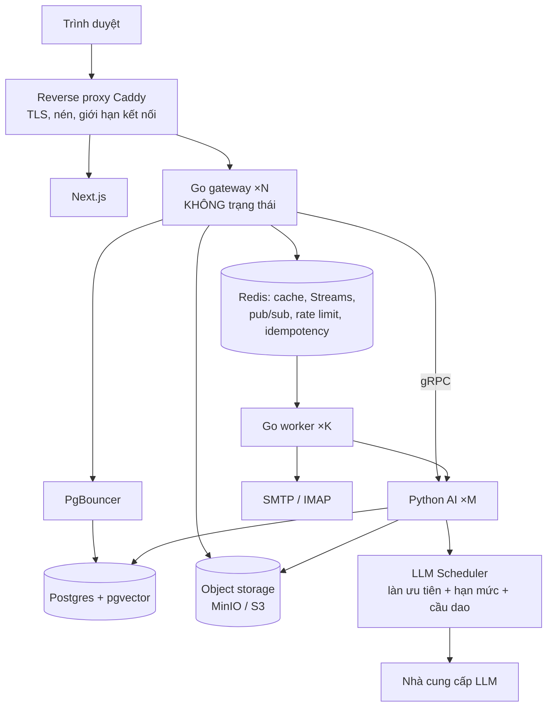

# EduPilot v2 — Thiết kế hệ thống

Viết theo bốn bước của system-design-primer: (1) ca sử dụng, ràng buộc, giả định + ước lượng; (2) thiết kế tổng thể; (3) đào sâu thành phần lõi; (4) tìm nút cổ chai và mở rộng.
Nguyên tắc xuyên suốt của tài liệu đó cũng là của tài liệu này: **mọi thứ đều là đánh đổi** — không thêm thành phần nào nếu không chỉ ra được nút cổ chai nó giải quyết.

## 1. Ràng buộc và giả định

### 1.1. Ba tầng tải

| Tầng | Quy mô | Vai trò trong đồ án |
| --- | --- | --- |
| T0 Demo | 1 lớp, 30 SV, 1 GV | Seed, demo bảo vệ |
| **T1 Mục tiêu thiết kế** | 1 học phần đại cương: 1.000 SV, 20 lớp, 5 TA, 3.000 câu hỏi/tuần (đúng bài toán gốc của Project III) | **Phải chạy được mà KHÔNG đổi kiến trúc; chứng minh bằng test tải ở P10** |
| T2 Lộ trình | Toàn trường: 10.000 SV, 50 học phần | Chỉ viết lộ trình mở rộng, không xây |

### 1.2. Ước lượng T1 (tính tay, làm tròn)

| Đại lượng | Cách tính | Kết quả |
| --- | --- | --- |
| Người dùng đồng thời lúc cao điểm (đêm trước hạn/thi) | 30% × 1.000 | 300 |
| Kết nối SSE thông báo mở cùng lúc | = người dùng đồng thời | 300 |
| Câu hỏi chat lúc cao điểm | 20% lượng tuần dồn vào 2 giờ = 600 câu / 2 h; đỉnh gấp 10 lần trung bình | ≈ 0,08 → 1 QPS |
| **Luồng LLM đồng thời** | 1 QPS × 10 s mỗi câu (định luật Little) | **≈ 10, đỉnh 50** |
| Token chat mỗi tuần | 3.000 × (3.000 vào + 500 ra) | ≈ 10,5 triệu |
| Heartbeat thời gian học | 300 / 30 s | 10 req/s |
| Bài nộp đợt hạn chót | 1.000 bài trong 1 ngày × 2 lượt chấm × ≈ 20 s | 40.000 giây-LLM → 5 worker ≈ 2,2 giờ |
| Token chấm một đợt | 1.000 × 2 × 6.000 | ≈ 12 triệu |
| File bài nộp mỗi kỳ | 1.000 × 4 bài × 2 MB | ≈ 8 GB |
| Vector | 100 tài liệu × 200 chunk × 1536 × 4 byte | ≈ 120 MB (T2: ≈ 6 GB) |
| Dòng `chat_messages` mỗi kỳ | 3.000 × 2 × 15 tuần | ≈ 90.000 |
| Dòng `study_time_daily` mỗi kỳ | 1.000 × 5 khu vực × 105 ngày | ≈ 525.000 |
| Tỷ lệ đọc : ghi | Dashboard, lịch, thư viện, sổ điểm đọc nhiều; ghi chủ yếu là chat và heartbeat | ≈ 20 : 1 |

### 1.3. Kết luận từ con số

Lưu lượng HTTP và dữ liệu đều **nhỏ** đối với một gateway Go và một Postgres. Hệ thống này không chết vì QPS. Nó chết vì năm thứ sau, và toàn bộ thiết kế xoay quanh chúng:

1. **LLM chậm, có hạn mức, tốn tiền** — tài nguyên khan hiếm duy nhất. Chấm 1.000 bài có thể ăn hết hạn mức và làm chat của sinh viên treo đúng đêm trước hạn.
2. **Kết nối sống lâu** (SSE, gRPC stream) — mỗi luồng giữ tài nguyên 10 s trở lên ở cả Go, Python và kết nối DB.
3. **Trạng thái nằm trong tiến trình hoặc trên đĩa cục bộ** — hiện file upload nằm ở volume `shared_uploads`; chừng nào còn thế thì không nhân bản gateway được.
4. **Truy vấn không giới hạn** — danh sách không phân trang, N+1, thiếu index theo `(course_id, …)` — nhanh với 30 SV, sập với 1.000.
5. **Việc nặng chạy trong request** — trích tài liệu, chấm bài, tạo báo cáo, gửi mail.

## 2. Thiết kế tổng thể

Quyết định kiến trúc (và cái bị từ chối):

| Chọn | Không chọn | Vì sao |
| --- | --- | --- |
| Modular monolith Go (1 gateway + 1 worker, chia gói theo module) | Microservices theo module | Một người làm; ranh giới gói đủ để tách sau. Microservices thêm vận hành mà không gỡ nút cổ chai nào ở T1 |
| Postgres duy nhất cho dữ liệu nghiệp vụ, ACID | NoSQL | Dữ liệu quan hệ, cần transaction (điểm, điểm danh), cần join; T2 mới ≈ vài chục GB |
| pgvector trong cùng Postgres | Vector DB riêng | 120 MB–6 GB vector; lọc theo `course_id` + `audience` ngay trong SQL là yêu cầu bảo mật |
| Redis Streams làm hàng đợi | RabbitMQ / Kafka | Đã có Redis; consumer group + ack + pending đủ cho at-least-once; thêm broker là thêm một thứ để hỏng |
| SSE | WebSocket | Chỉ cần server → client; SSE đi qua proxy dễ, tự kết nối lại, có `Last-Event-ID` |
| Object storage (MinIO khi tự host, S3 khi lên mây) | Volume dùng chung | Điều kiện tiên quyết để gateway không trạng thái |
| Reverse proxy ngay từ đầu | Phơi thẳng gateway | TLS, nén, giới hạn kết nối, và là chỗ cắm cân bằng tải khi nhân bản — đúng ý primer: reverse proxy có ích cả khi chỉ có một máy chủ |

## 3. Thành phần lõi

### 3.1. LLM Scheduler — bảo vệ tài nguyên khan hiếm nhất (Python `src/llm/scheduler.py`)

- **Ba làn ưu tiên:** `INTERACTIVE` (chat, giải thích đáp án) > `NEAR_REALTIME` (phân loại kênh, trích công thức, gợi ý rubric) > `BATCH` (chấm bài, sinh câu hỏi, báo cáo). Làn BATCH chỉ được dùng tối đa 50% hạn mức khi có việc INTERACTIVE đang chờ.
- **Hạn mức theo provider:** token bucket cho RPM và TPM, đọc từ `llm_models`; semaphore số luồng đồng thời. Trạng thái bucket nằm ở Redis để nhiều bản Python dùng chung.
- **Back pressure:** hàng chờ INTERACTIVE có giới hạn độ dài. Đầy thì trả lỗi "đang quá tải" kèm thời gian chờ ước tính, KHÔNG xếp hàng vô hạn. UI hiện thông báo chờ và nút thử lại/nhờ giảng viên.
- **Cầu dao (circuit breaker):** lỗi liên tiếp hoặc 429 → mở cầu dao provider đó 30 s, chuyển sang fallback (M12). Thử lại có backoff luỹ thừa + jitter.
- **Thời hạn (deadline):** mọi lời gọi mang deadline từ request gốc (context Go → metadata gRPC → Python). Người dùng đóng tab thì huỷ luồng LLM, không đốt token vô ích.
- **Suy giảm có kiểm soát:** mọi provider đều chết → chat trả lời trích xuất từ chunk (repo đã có `_build_extractive_answer_from_chunks`) kèm nhãn "AI tạm thời không khả dụng", và mời escalate.
- **Giảm cầu:** semantic cache (đã có) cho câu hỏi học thuật; không cache câu hỏi cá nhân; dedupe các yêu cầu giống hệt đang bay.

### 3.2. Gateway không trạng thái

- Không giữ gì trong bộ nhớ tiến trình ngoài cache chỉ-đọc có TTL ngắn: phiên = JWT; rate limit, ánh xạ placeholder, idempotency, hạn mức = Redis; file = object storage.
- **Thông báo SSE qua nhiều bản:** `NotificationService` ghi DB rồi `PUBLISH notify:<user_id>`; bản gateway nào đang giữ kết nối của người đó thì đẩy xuống. Mất kết nối → client gửi `Last-Event-ID`, gateway đọc bù từ bảng `notifications`.
- **Stream chat tiếp tục được:** token đang sinh được nối vào `chat_messages.partial_content` mỗi ≈ 1 s. Tải lại trang giữa chừng vẫn thấy phần đã sinh và trạng thái cuối, không mất câu trả lời đã tốn tiền.
- Giới hạn và timeout ở mọi tầng: đọc/ghi HTTP, kích thước body, số SSE mỗi người (2), thời gian stream tối đa (120 s), pool pgx có `MaxConns` nhỏ + PgBouncer transaction mode.

### 3.3. Dữ liệu: nhất quán ở đâu, lỏng ở đâu

| Dữ liệu | Mô hình nhất quán | Cách làm |
| --- | --- | --- |
| Điểm, công thức điểm, điểm danh, điểm cộng, bài nộp, ticket | **Mạnh (CP)** | Một Postgres primary, transaction, khoá lạc quan bằng cột `version` (trả 409 khi hai giảng viên sửa cùng ô) |
| Thông báo, mail, việc chấm bài | **At-least-once + idempotent** | Transactional outbox (ghi nghiệp vụ + outbox trong cùng transaction; worker phát đi); consumer khử trùng bằng khoá |
| Analytics, at-risk, thời gian học, báo cáo lỗ hổng, usage LLM | **Nhất quán sau cùng** | Tổng hợp nền; hiển thị "cập nhật lúc …" |
| Cache câu trả lời, cache deadline | Cache-aside + **vô hiệu theo sự kiện** | Đổi hạn/tài liệu/công thức → publish sự kiện → xoá khoá liên quan. TTL chỉ là lưới an toàn |
| Heartbeat | Write-behind có chủ ý | Cộng dồn ở Redis, worker ghi DB mỗi phút. Mất vài phút số liệu khi Redis sập là chấp nhận được vì dữ liệu này chỉ để tham khảo (D17) |

Quy tắc lược đồ để T1 không gãy:

- Mọi bảng nghiệp vụ có `course_id`; index phức hợp bắt đầu bằng `course_id`. Đây là khoá phân mảnh tự nhiên nếu T2 cần partition.
- Mọi danh sách **phân trang bằng con trỏ** (`?cursor=&limit=`, tối đa 100). Cấm `OFFSET` trên bảng lớn, cấm trả danh sách không giới hạn.
- Cấm N+1: handler danh sách chỉ dùng truy vấn JOIN/batch của sqlc. Bật log truy vấn chậm > 200 ms.
- Bảng chỉ-thêm lớn (`llm_audit`, `pii_events`, `audit_log`, `chat_messages`): index theo `(course_id, created_at)`; T2 partition theo tháng.
- Vector: lọc `course_id` + `audience` trong cùng truy vấn với tìm kiếm HNSW; T2 dùng partial index theo khoá học lớn.
- File: DB chỉ lưu khoá object + metadata. Tải lên/xuống bằng **URL ký sẵn** để byte không đi qua gateway.
- Điểm số `numeric`, thời gian `timestamptz` (lưu UTC, hiển thị `Asia/Ho_Chi_Minh`).

### 3.4. Việc nền (Redis Streams)

| Stream | Nhà sản xuất | Khoá idempotent | Ghi chú |
| --- | --- | --- | --- |
| `outbox.dispatch` | Mọi service qua bảng `outbox` | `outbox.id` | Phát thông báo, mail, sự kiện vô hiệu cache |
| `grading.jobs` | Bài nộp mới, "Chấm tất cả" | `(submission_id, version)` | Làn BATCH; số worker đồng thời cấu hình được |
| `ingest.jobs` | Upload tài liệu | `documents.content_hash` | Thay cho gọi đồng bộ hiện tại |
| `mail.inbound` | Poller IMAP | `message_uid` | Một poller duy nhất nhờ khoá phân tán Redis |
| `insight.jobs`, `reindex.jobs`, `reminder.jobs`, `heartbeat.rollup` | API / cron | tự nhiên theo việc | Cron chạy ở worker giữ khoá leader |

Mọi consumer: consumer group, ack sau khi xong, thử lại 3 lần có backoff, quá thì vào `<stream>.dead` và hiện trên `/observability`. Việc dài trả **202 + job id**; tiến độ đẩy qua SSE.

### 3.5. Quy ước API chịu được mạng xấu

- `Idempotency-Key` bắt buộc cho POST có tác dụng phụ (gửi trả lời ticket, công bố điểm, chốt điểm, nộp bài thi thử). Lưu Redis 24 h. Bấm đúp hay mạng rớt rồi gửi lại không tạo bản ghi đôi.
- `PUT` cho thao tác ghi cả lưới (điểm danh) — idempotent tự nhiên.
- `ETag` / `If-None-Match` cho dữ liệu đọc nhiều ít đổi (lịch, thư viện, công thức điểm).
- Lỗi có cấu trúc `{code, message, details, retry_after?}` để UI biết tự thử lại hay hỏi người dùng.

### 3.6. Bảo mật (mục Security của primer)

TLS ở reverse proxy; mọi đầu vào được validate; chỉ truy vấn tham số hoá (sqlc); quyền tối thiểu: user DB của Python chỉ có SELECT trên view nghiệp vụ; secret mã hoá khi lưu; rate limit theo người dùng và theo IP; tải file chỉ qua URL ký sẵn ngắn hạn sau khi kiểm quyền; CORS theo danh sách; log không PII. Mã tham gia lớp: 31^7 ≈ 2,7 × 10^10 khả năng + giới hạn 5 lần / 10 phút + lỗi đồng nhất → dò mã là bất khả thi; tạo lại mã vô hiệu mã cũ ngay; vai trò chỉ do Admin cấp, `/register` không bao giờ tạo được TEACHER.

## 4. Nút cổ chai và lộ trình mở rộng

| Giai đoạn | Hạ tầng | Gỡ nút cổ chai nào | Thay đổi code |
| --- | --- | --- | --- |
| **S1 — T0/T1 (xây trong đồ án)** | 1 VPS 4 vCPU / 8 GB, Docker Compose: Caddy, gateway ×1, worker ×1, Python ×1, Postgres, PgBouncer, Redis, MinIO | – | – |
| S2 — T1 lúc cao điểm | Tăng `replicas` gateway/Python/worker; Caddy cân bằng tải | Luồng đồng thời, SSE | **Không** (nhờ 3.2) |
| S3 — tiến tới T2 | Postgres managed + read replica cho analytics/insight; Redis managed; S3; CDN cho tĩnh | Đọc nặng của dashboard; đĩa | Chỉ thêm DSN chỉ-đọc cho gói analytics |
| S4 — T2 | Partition bảng chỉ-thêm theo tháng; partial index vector; tách Python chấm bài khỏi Python chat; nhiều khoá API/provider | Kích thước bảng; tranh chấp LLM | Nhỏ, cục bộ |

Cái **cố ý không làm**: sharding, master-master, Kubernetes, service discovery, Kafka, đa vùng. Con số ở 1.2 không biện minh cho chúng; mỗi thứ là thêm chế độ hỏng mà một người phải vận hành.

### Tính sẵn sàng

Chuỗi nối tiếp proxy → gateway → Postgres → Redis trên một máy: mục tiêu thực tế là 99,5% trong học kỳ (≈ 50 phút ngừng mỗi tuần, đủ cho bảo trì ngoài giờ). LLM bên ngoài nằm ngoài tầm kiểm soát nên được nối **song song** (fallback provider) và có đường suy giảm. Sao lưu Postgres hằng đêm + thử khôi phục một lần trước khi bảo vệ.

## 5. Mục tiêu dịch vụ (SLO) và cách đo

| Chỉ số | Mục tiêu ở tải T1 | Đo bằng |
| --- | --- | --- |
| API đọc p95 / ghi p95 | ≤ 300 ms / ≤ 500 ms | k6 + OpenTelemetry |
| TTFT chat p95 | ≤ 1,5 s cache hit; ≤ 4 s RAG | k6 kịch bản SSE |
| Chuông thông báo | ≤ 5 s | Test tích hợp |
| Dashboard / hồ sơ 360 | ≤ 3 s với 1.000 SV | k6 trên dữ liệu T1 |
| Chấm 1.000 bài | ≤ 3 giờ **và** TTFT chat không xấu đi quá 20% trong lúc chấm | Kịch bản hỗn hợp |
| Không mất việc | 0 việc thất lạc khi giết worker giữa chừng | Test hỗn loạn nhỏ |
| Tỷ lệ lỗi 5xx | < 0,5% | k6 |

Bộ sinh dữ liệu `scripts/seed-t1.mjs` tạo 1.000 SV / 20 lớp / một học kỳ dữ liệu để các phép đo trên có nghĩa. Kịch bản k6 nằm ở `benchmarks/load/`. LLM dùng provider giả có độ trễ mô phỏng (phân phối 5–15 s) để test tải không tốn tiền.

## 6. Ánh xạ sang phase

| Hạng mục | Phase |
| --- | --- |
| Object storage + URL ký sẵn, Caddy, PgBouncer, timeout/giới hạn, log truy vấn chậm | PG |
| LLM Scheduler (làn, hạn mức, cầu dao, deadline, suy giảm) | P1 |
| Phân trang con trỏ, `Idempotency-Key`, `ETag`, khoá lạc quan — thành chuẩn cho MỌI API mới | P2 trở đi (API cũ giữ nguyên trong PG, nâng dần sau) |
| Outbox + SSE qua pub/sub + `Last-Event-ID` | P4 |
| Stream chat tiếp tục được | P3 |
| Heartbeat write-behind | P5 |
| `ingest.jobs`, `grading.jobs` làn BATCH | P7, P8 |
| `seed-t1`, k6, test hỗn loạn, SLO | P10 (khung k6 dựng từ PG để đo mốc) |
